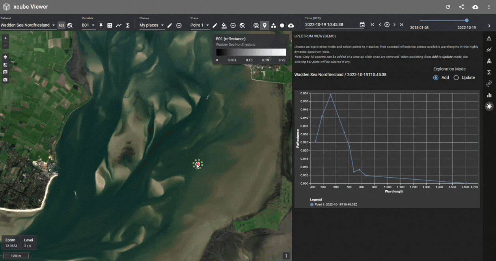
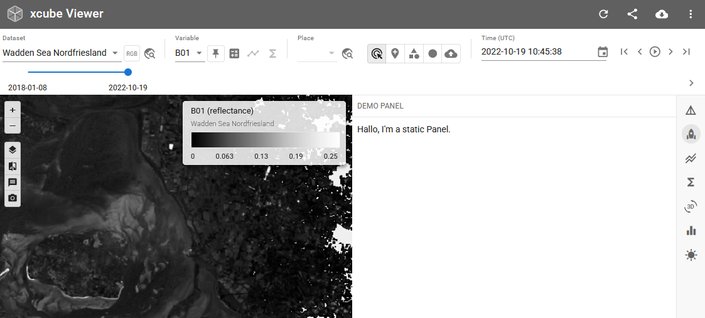
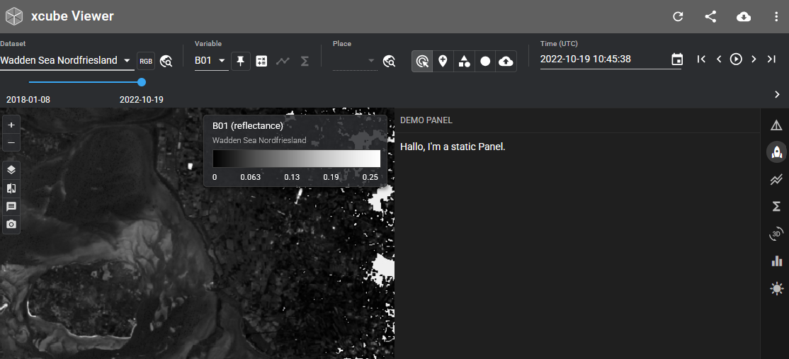
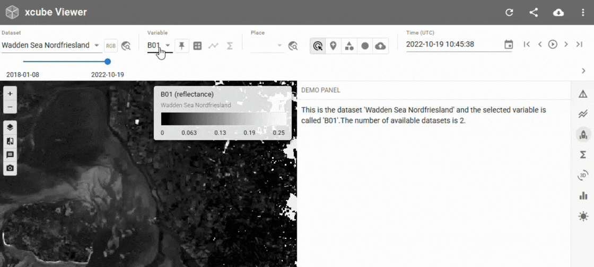
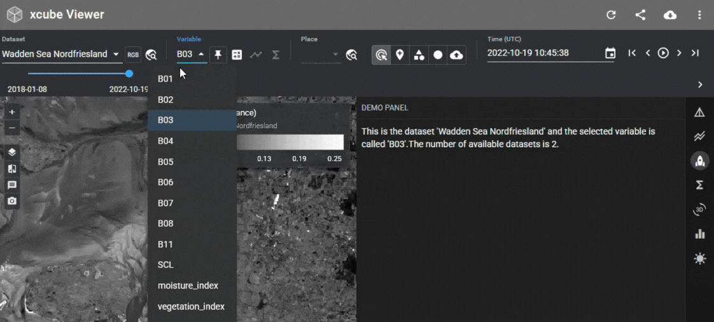

# Extend xcube Viewer with custom panels



!!! info inline end Further examples

    For more example panels see the [chartlets](https://github.com/bcdev/chartlets/tree/main/chartlets.py/demo) 
    and the [xcube](https://github.com/xcube-dev/xcube/tree/main/examples/serve/panels-demo) demo panels.

Starting with xcube Server 1.8 and xcube Viewer 1.4 it is possible to enhance
xcube Viewer by **custom sidebar panels** programmed in Python contributed from the server-side.

For this to work, service providers can now configure xcube Server to load
one or more Python modules that provide UI-contributions of type
`xcube.webapi.viewer.contrib.Panel`.
Users can create `Panel` objects and use the two decorators
`layout()` and `callback()` to implement the UI and the interaction
behaviour, respectively. The new functionality is provided by the
[Chartlets](https://bcdev.github.io/chartlets/) Python library.

## Available State Properties

xcube Viewer exposes some of its application state properties to Python
extension components, e.g., `panel = Panel(...)`. The current values of state
properties can be accessed via `Input` and `State` channels you define for your
extension component decorators, i.e., `@panel.layout(...)` and/or `@panel.callback(...)`.

!!! info inline end

    To check the available StateProperties of your specific Viewer check the 
    **Developer Reference**, that is linked in the header of the Viewer.

- To trigger a callback call when a state property changes use the input syntax
  `Input("@app", "<property>")`.
- To just read a property from the state use `State("@app", "<property>")`. This
  will not trigger a call to your callback.

The following state properties of xcube Viewer's (`xcube-viewer>=v1.5.1`) are made available
to extensions:

| Property                 | Python Type                | Description                                                                 |
|--------------------------|----------------------------|-----------------------------------------------------------------------------|
| selectedDatasetId        | str \| None               | The identifier of the currently selected dataset.                          |
| selectedDatasetTitle     | str \| None               | The title of the currently selected dataset.                               |
| selectedVariableName     | str \| None               | The name of the currently selected variable within the selected dataset.   |
| selectedDataset2Id       | str \| None               | The identifier of the dataset that contains the pinned variable.           |
| selectedDataset2Title    | str \| None               | The title of the dataset that contains the pinned variable.                |
| selectedVariable2Name    | str \| None               | The name of the pinned variable.                                           |
| selectedPlaceGeometry    | dict[str, Any] \| None    | The geometry of the currently selected place in GeoJSON format.            |
| selectedPlaceId          | str \| None               | The identifier of the currently selected place.                            |
| selectedPlaceGroup       | list[dict[str, Any]]      | The list of dataset place group and user place groups.                     |
| selectedTimeLabel        | str \| None               | The currently selected UTC time using ISO format.                          |
| themeMode                | str                       | The appearance mode of the UI. Either "light" or "dark".                   |


## How to add a panel

1. Write a Python module that defines one or more contributions — each one
   becomes a custom panel in the viewer's sidebar (see [Examples](#examples)).

2. Create the *Extension* object in `<folder-to-my-panels>/__init__.py`:

    ```python
    from chartlets import Extension
    from .my_panel import panel as my_panel
    
    ext = Extension(__name__)
    ext.add(my_panel)
    ```

3. Register the module in the xcube Server configuration (`server-config.yaml`).

    ```yaml
    Viewer:
      Augmentation:
        Path: ""
        Extensions:
          - <folder-to-my-panels>.ext
    ```

4. Start xcube-server as usual — the panels will appear in the sidebar alongside
   the built-in **Info**, **Time Series**, and **Statistics** panels.

## Examples
### Static panel

{: class="light-image" }
{: class="dark-image" }

Create `<folder-to-my-panels>/my_panel.py`:
```python
from chartlets import Component
from chartlets.components import Box, Typography

from xcube.server.api import Context
from xcube.webapi.viewer.contrib import Panel


panel = Panel(__name__, title="Demo Panel", position=1, icon="rocket")

@panel.layout()
def render_panel(
    ctx: Context,
) -> Component:

    info_text = Typography(
        id="info_text", children=["Hallo, I'm a static Panel."]
    )

    return Box(
        children=[
            info_text,
        ],
    )
```

### Reactive panel

{: class="light-image" }
{: class="dark-image" }

```python
from chartlets import Component, Input, Output, State
from chartlets.components import Box, Typography

from xcube.server.api import Context
from xcube.webapi.viewer.contrib import Panel, get_datasets_ctx

panel = Panel(__name__, title="Demo Panel", position=2, icon="rocket")

@panel.layout(
    State("@app", "selectedDatasetTitle"),
    State("@app", "selectedVariableName"),
)
def render_panel(
    ctx: Context,
    dataset_id: str,
    variable_name: str,
) -> Component:

    info_text = Typography(
        id="info_text",
        children=update_info_text(ctx, dataset_id, variable_name),
    )

    return Box(
        style={
            "display": "flex",
            "flexDirection": "column",
            "width": "100%",
            "height": "100%",
            "gap": "6px",
        },
        children=[
            info_text,
        ],
    )

@panel.callback(
    Input("@app", "selectedDatasetTitle"),
    Input("@app", "selectedVariableName"),
    Output("info_text", "children"),
)
def update_info_text(
    ctx: Context,
    dataset_id: str,
    variable_name: str,
) -> list[str]:
    ds_ctx = get_datasets_ctx(ctx)
    ds_configs = ds_ctx.get_dataset_configs()

    return [
            f"This is the dataset '{dataset_id}' and the selected variable is called '{variable_name}'."
            f"The number of available datasets is {len(ds_configs)}."
        ]
```

## Available components

Chartlets provides a growing set of components you can return from
contributions. Refer to the
[Chartlets component reference](https://bcdev.github.io/chartlets/api/components/)
for the full list; commonly used ones include:

- `Accordion`,`Button`, `Checkbox`, `RadioGroup` `Slider`, `Switch`, `Table`,
  `Tabs`, `Typography`, `VegaChart`

