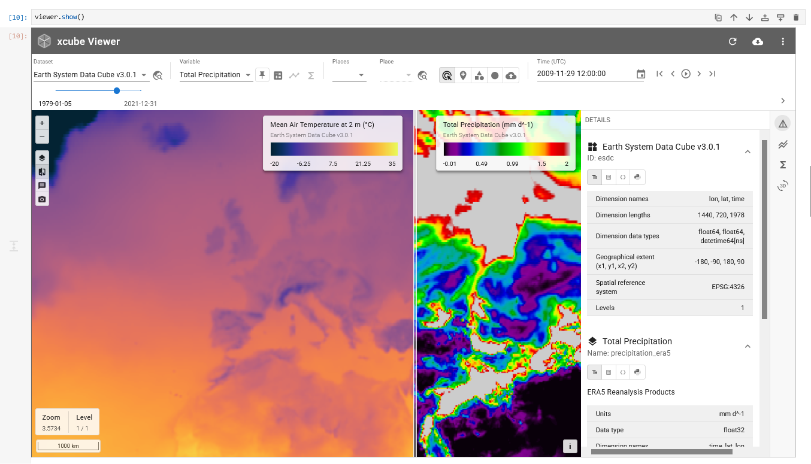

# Ways to use xcube Viewer

There are several ways to use xcube Viewer, depending on whether you want to
explore data interactively, serve data from an xcube Server, or build a
standalone deployment.

## Jupyter Notebook

Use this option when you want to explore data from a notebook. It is useful for
interactive analysis, development, and quick checks before preparing a
server-backed Viewer deployment.



See how to use the Viewer in a Jupyter Notebook in this
[example notebook](https://earthsystemdatalab.net/guide/jupyterlab/notebooks/generic-notebooks/Visualise_data_with_xcube_viewer/).

## xcube CLI

xcube Viewer is bundled with the
[xcube](https://github.com/xcube-dev/xcube) Python package. Run xcube Server
with a server configuration and open the Viewer through the server endpoint
`/viewer`.

```bash
xcube serve -c server-config.yaml
```

When run locally without a URL prefix, the Viewer is available at
`http://127.0.0.1/viewer`.

For learning how to set up an xcube Server, see the
[xcube documentation](https://xcube.readthedocs.io/en/latest/cli/xcube_serve.html). 

## Build and Deploy

You can also build and deploy your own Viewer instance. In the latter case,
visit the [xcube Viewer repository](https://github.com/xcube-dev/xcube-viewer)
on GitHub and follow the instructions provided in the related
[README](https://github.com/xcube-dev/xcube-viewer/blob/main/README.md) file.

The README includes instructions for running the Viewer in development mode,
building the `dist` output, and updating the Viewer bundle used by xcube.
