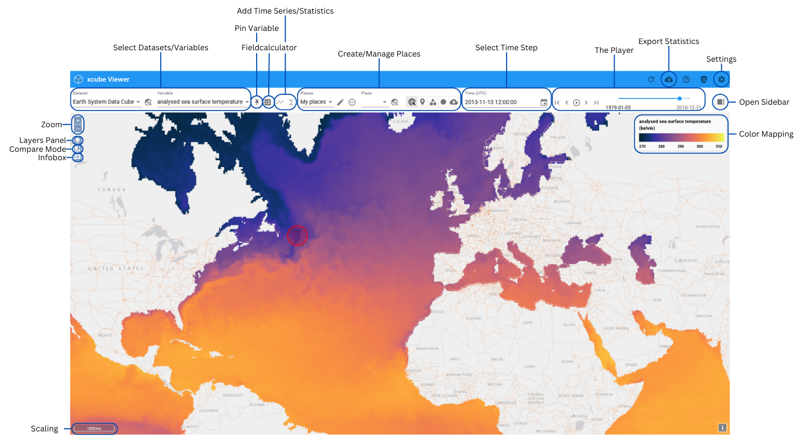
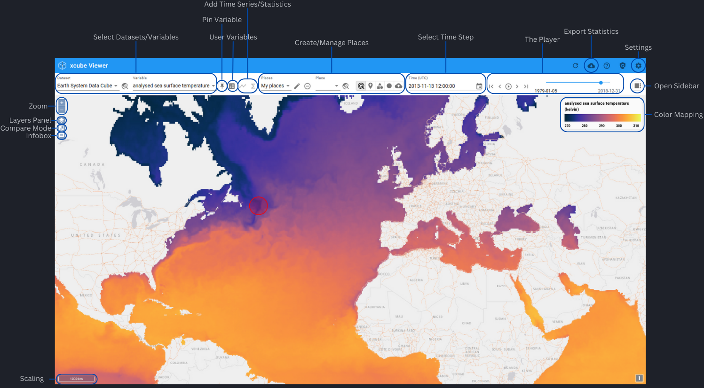

---
hide:
  - toc
---

# Feature References

{: class="light-image" }
{: class="dark-image" }

A list of all the features that the viewer contains will be created here, in which the functionality of each one is explained in more detail.
