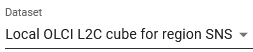

# Feature References

{: class="light-image" }
{: class="dark-image" }

A list of all the features that the viewer contains will be created here, in which the functionality of each one is explained in more detail.

### Select Dataset

|  |                                                                                                                                                                                                                                                                                                                                                                                                                                                                                                                        |
| ------------------------------------------------------------ | ---------------------------------------------------------------------------------------------------------------------------------------------------------------------------------------------------------------------------------------------------------------------------------------------------------------------------------------------------------------------------------------------------------------------------------------------------------------------------------------------------------------------- |
| **Feature Name**                                             | **Select Dataset**                                                                                                                                                                                                                                                                                                                                                                                                                                                                                                     |
| **Description**                                              | A drop-down menu, grouped by data format, selected dataset is highlighted                                                                                                                                                                                                                                                                                                                                                                                                                                              |
| **Functionality**                                            | - Holds all datasets available on the server.   - The map’s zoom and pan behavior upon dataset selection depends on [user-defined settings](user_guide/settings.md/#zoom-on-datasetvariable-selection).   - When a new dataset is selected:   &nbsp;&nbsp;&nbsp;&nbsp;- The first variable in the dataset is automatically selected, **or**   &nbsp;&nbsp;&nbsp;&nbsp;- If the new dataset contains a variable with the same name as the previously selected variable, that variable will be pre-selected. |
| **Aim/Purpose**                                              | To help users quickly access and switch between datasets.                                                                                                                                                                                                                                                                                                                                                                                                                                                              |

### Locate Dataset in Map

|  |                                               |
| ------------------------------------------------------------ | --------------------------------------------- |
| **Feature Name**                                             | **Locate Dataset**                            |
| **Description**                                              | Button                                        |
| **Functionality**                                            | Pans and zooms to extent of selected dataset. |
| **Aim/Purpose**                                              | To quickly return to extent of dataset.       |

### Select Variable

|  |                                                                                                                                                                                                                                                                                                |
| ------------------------------------------------------------ | ---------------------------------------------------------------------------------------------------------------------------------------------------------------------------------------------------------------------------------------------------------------------------------------------- |
| **Feature Name**                                             | **Select Variable**                                                                                                                                                                                                                                                                            |
| **Description**                                              | A drop-down menu lists all variables in the dataset, ordered according to their sequence in the dataset. [User-defined variables](user_guide/analyse.md/#user-variables) are marked with an icon and placed at the bottom of the list. The currently selected variable is highlighted in blue. |
| **Functionality**                                            | Displays all variables available in the dataset, along with any user-defined variables. The map’s zoom and pan behavior when selecting a dataset depends on the [user-defined settings](user_guide/settings.md/#zoom-on-datasetvariable-selection).                                            |
| **Aim/Purpose**                                              | To help users quickly access and switch between variables.                                                                                                                                                                                                                                     |

---
