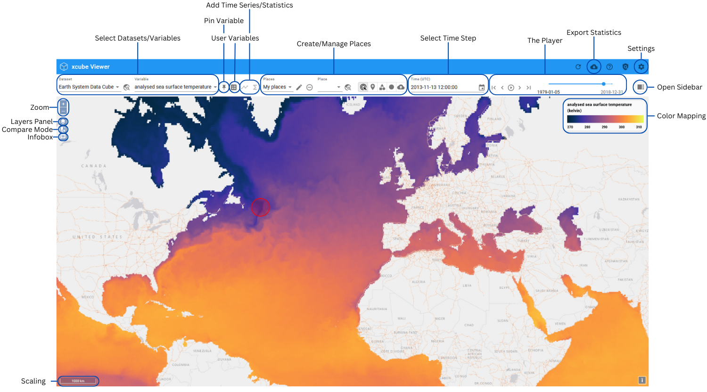

# Feature References

{: class="light-image" }
{: class="dark-image" }

A list of all the features that the viewer contains will be created here, in which the functionality of each one is explained in more detail.

## General Features

### Select Dataset

<table>
	<thead>
		<tr>
			<th colspan="2">
				
			</th>
		</tr>
	</thead>
	<tbody>
		<tr>
			<td><b>Feature Name</b></td>
			<td>Select Dataset</td>
		</tr>
		<tr>
			<td><b>Description</b></td>
			<td>
				A drop-down menu, grouped by data format, selected dataset is
				highlighted
			</td>
		</tr>
		<tr></tr>
		<tr>
			<td><b>Functionality</b></td>
			<td>
				<ul>
					<li>Holds all datasets available on the server.</li>
					<li>
						The map's zoom and pan behavior upon dataset selection depends on
						<a
							href="/user_guide/settings/#zoom-on-datasetvarialbe-selection"
							rel="noopener noreferrer"
							>user-defined settings</a
						>.
					</li>
					<li>When a new dataset is selected:</li>
					<ul>
						<li>
							The first variable in the dataset is automatically selected,
							<b>or</b>
						</li>
						<li>
							If the new dataset contains a variable with the same name as the
							previously selected variable, that variable will be pre-selected.
						</li>
					</ul>
				</ul>
			</td>
		</tr>
		<tr>
			<td colspan="2">
				Link to feature mentioned in
				<a
					href="/user_guide/getting_started/#select-dataset-and-variables"
					rel="noopener noreferrer"
					>User Guide</a
				>.
			</td>
		</tr>
	</tbody>
</table>

### Locate Dataset in Map

<table>
	<thead>
		<tr>
			<th colspan="2">
				
			</th>
		</tr>
	</thead>
	<tbody>
		<tr>
			<td><b>Feature Name</b></td>
			<td>Locate Dataset</td>
		</tr>
		<tr>
			<td><b>Description</b></td>
			<td>Button</td>
		</tr>
		<tr></tr>
		<tr>
			<td><b>Functionality</b></td>
			<td>Pans and zooms to extent of selected dataset.</td>
		</tr>
	</tbody>
</table>

### Select Variable

<table>
	<thead>
		<tr>
			<th colspan="2">
				
			</th>
		</tr>
	</thead>
	<tbody>
		<tr>
			<td><b>Feature Name</b></td>
			<td>Select Variable</td>
		</tr>
		<tr>
			<td><b>Description</b></td>
			<td>
				A drop-down menu lists all variables in the dataset, ordered according
				to their sequence in the dataset.
				<a href="user_guide/analyse/#user-variables" rel="noopener noreferrer"
					>User-defined variables</a
				>
				are marked with an icon and placed at the bottom of the list. The
				currently selected variable is highlighted in blue.
			</td>
		</tr>
		<tr></tr>
		<tr>
			<td><b>Functionality</b></td>
			<td>
				Displays all variables available in the dataset, along with any
				user-defined variables. The map's zoom and pan behavior when selecting a
				dataset depends on the
				<a
					href="/user_guide/settings/#zoom-on-datasetvarialbe-selection"
					rel="noopener noreferrer"
					>user-defined settings</a
				>.
			</td>
		</tr>
		<tr>
			<td><b>Aim</b></td>
			<td>Enable users to easily access and switch between variables.</td>
		</tr>
		<tr>
			<td colspan="2">
				Link to feature mentioned in
				<a
					href="/user_guide/getting_started/#select-dataset-and-variables"
					rel="noopener noreferrer"
					>User Guide</a
				>.
			</td>
		</tr>
	</tbody>
</table>

---

### Show/Hide Layer Panel

<table>
	<thead>
		<tr>
			<th colspan="2">
				
			</th>
		</tr>
	</thead>
	<tbody>
		<tr>
			<td><b>Feature Name</b></td>
			<td>Show/Hide Layer Panel</td>
		</tr>
		<tr>
			<td><b>Description</b></td>
			<td>Button, highlighted when feature is enabled</td>
		</tr>
		<tr></tr>
		<tr>
			<td><b>Functionality</b></td>
			<td>
				Shows or hides the
				<a href="#layer-panel" rel="noopener noreferrer">Layer Panel</a>.
			</td>
		</tr>
		<tr>
			<td><b>Aim</b></td>
			<td>Enable users to control the visibility of layers.</td>
		</tr>
		<tr>
			<td colspan="2">
				Link to feature mentioned in
				<a
					href="/user_guide/getting_started/#adjust-layer-visibilities"
					rel="noopener noreferrer"
					>User Guide</a
				>.
			</td>
		</tr>
	</tbody>
</table>

### Layer Panel

<table>
	<thead>
		<tr>
			<th colspan="2">
				
			</th>
		</tr>
	</thead>
	<tbody>
		<tr>
			<td><b>Feature Name</b></td>
			<td>Layer Panel</td>
		</tr>
		<tr>
			<td><b>Description</b></td>
			<td>
				A draggable window displaying a list of available layers, with options
				at the bottom to add user-defined basemaps or overlays. Visible layers
				are marked with a checkmark, while pinned variables are indicated by a
				pin icon.
			</td>
		</tr>
		<tr></tr>
		<tr>
			<td><b>Functionality</b></td>
			<td>
				The Layer Panel allows users to show or hide the following layers: the
				selected variable, pinned variable (marked with an icon), user and
				dataset places, base map and overlay, the boundary box of the selected
				dataset, and the RGB of both the selected and pinned dataset. It also
				enables users to add or modify user variables or overlays, a function
				that can also be performed in the
				<a
					href="user_guide/settings/#base-maps-and-overlays"
					rel="noopener noreferrer"
					>settings</a
				>. The window appears when the function is enabled and can be closed
				either by clicking the <code>X</code> or by clicking the button again.
			</td>
		</tr>
		<tr>
			<td><b>Aim</b></td>
			<td>Enable users to controll the visibility of layers.</td>
		</tr>
		<tr>
			<td colspan="2">
				Link to feature mentioned in
				<a
					href="/user_guide/getting_started/#adjust-layer-visibilities"
					rel="noopener noreferrer"
					>User Guide</a
				>.
			</td>
		</tr>
	</tbody>
</table>

### Information Box

<table>
	<thead>
		<tr>
			<th colspan="2">
				
			</th>
		</tr>
	</thead>
	<tbody>
		<tr>
			<td><b>Feature Name</b></td>
			<td>Information Box</td>
		</tr>
		<tr>
			<td><b>Description</b></td>
			<td>Button, highlighted when function is enabled</td>
		</tr>
		<tr></tr>
		<tr>
			<td><b>Functionality</b></td>
			<td>
				Displays an information box that provides pixel details for the area
				being hovered over. This includes latitude, longitude, the selected
				variable, and the pinned variable.
			</td>
		</tr>
		<tr>
			<td><b>Aim</b></td>
			<td>Enable users to quickly access information about a pixel.</td>
		</tr>
		<tr>
			<td colspan="2">
				Link to feature mentioned in
				<a
					href="/user_guide/analyse/#infobox"
					rel="noopener noreferrer"
					>User Guide</a
				>.
			</td>
		</tr>
	</tbody>
</table>

## Compare Variables

### Pin Variables

<table>
	<thead>
		<tr>
			<th colspan="2">
				
			</th>
		</tr>
	</thead>
	<tbody>
		<tr>
			<td><b>Feature Name</b></td>
			<td>Pin Variable</td>
		</tr>
		<tr>
			<td><b>Description</b></td>
			<td>
				Button that has a dark background when activated or when a pinned
				variable is selected.
			</td>
		</tr>
		<tr></tr>
		<tr>
			<td><b>Functionality</b></td>
			<td>
				The button pins a variable. When a variable is pinned, the 
				<a
					href="#split-mode"
					rel="noopener noreferrer"
					>split mode</a
				> for visual comparison is automatically activated, if it hasn't
				been opened yet. A variable can be unpinned by clicking the button
				again. If the variable should remain pinned but the split mode should be
				closed, the split mode button must be clicked.
			</td>
		</tr>
		<tr>
			<td><b>Aim</b></td>
			<td>To pin variables for comparison.</td>
		</tr>
		<tr>
			<td colspan="2">
				Link to feature mentioned in
				<a
					href="/user_guide/analyse/#compare-variables"
					rel="noopener noreferrer"
					>User Guide</a
				>.
			</td>
		</tr>
	</tbody>
</table>

### Split Mode

<table>
	<thead>
		<tr>
			<th colspan="2">
				
			</th>
		</tr>
	</thead>
	<tbody>
		<tr>
			<td><b>Feature Name</b></td>
			<td>Split Mode</td>
		</tr>
		<tr>
			<td><b>Description</b></td>
			<td>
				A button, highlighted when the function is enabled. When the mode is
				activated, the screen is divided in the middle by a slidable line.
			</td>
		</tr>
		<tr></tr>
		<tr>
			<td><b>Functionality</b></td>
			<td>
				In comparison mode, the currently selected variable is displayed on the
				right side of the slidable line. If a variable is pinned, it is
				displayed on the left side of the screen along with its color bar. But
				the pinned variable can also be made transparent using the layer
				visibility menu. The slidable line allows users to shift the view,
				enabling spatial comparison with underlying layers, such as basemaps or
				the pinned variable. Comparison mode is automatically activated when a
				variable is pinned, and the variable on the left can be displayed with
				transparency to enhance the comparison.
			</td>
		</tr>
		<tr>
			<td><b>Aim</b></td>
			<td>
				Enables visual comparison of the selected variable with another (pinned
				variable) or with other layers, such as a user basemap or dataset RGB.
			</td>
		</tr>
		<tr>
			<td colspan="2">
				Link to feature mentioned in
				<a
					href="/user_guide/analyse/#compare-variables"
					rel="noopener noreferrer"
					>User Guide</a
				>.
			</td>
		</tr>
	</tbody>
</table>

## User Variables

### Open User Variable Management

<table>
	<thead>
		<tr>
			<th colspan="2">
				
			</th>
		</tr>
	</thead>
	<tbody>
		<tr>
			<td><b>Feature Name</b></td>
			<td>Open User Variable Management</td>
		</tr>
		<tr>
			<td><b>Description</b></td>
			<td>A button that opens a window for managing user variables.</td>
		</tr>
		<tr>
			<td><b>Aim</b></td>
			<td>To open user variable management menu.</td>
		</tr>
		<tr>
			<td colspan="2">
				Link to feature mentioned in
				<a href="/user_guide/analyse/#user-variables" rel="noopener noreferrer"
					>User Guide</a
				>.
			</td>
		</tr>
	</tbody>
</table>

### User Variable Management

<table>
	<thead>
		<tr>
			<th colspan="2">
				
			</th>
		</tr>
	</thead>
	<tbody>
		<tr>
			<td><b>Feature Name</b></td>
			<td>User Variable Management</td>
		</tr>
		<tr>
			<td><b>Description</b></td>
			<td>
				A window for managing user variables when activated through
				<a href="#open-user-variable-management" rel="noopener noreferrer"
					>this feature</a
				>. The window displays a list of all existing user variables, including
				their name, title, units, and expression. It also contains various
				buttons for managing user variables, as well as a button that opens an
				informational text regarding user variables.
			</td>
		</tr>
		<tr></tr>
		<tr>
			<td><b>Functionality</b></td>
			<td>
				The following features can be used to manage the variables:  
				When no variable is selected:
				<ul>
					<li>
						<a href="#add-user-variable" rel="noopener noreferrer"
					><strong>Add User Variable</strong></a
				>: Opens a new window to create a
						user variable.
					</li>
				</ul>
				When a user variable is selected:
				<ul>
					<li>
						<a href="#add-user-variable" rel="noopener noreferrer"
					><strong>Add User Variable</strong></a
				>: Opens a new window to create a
						user variable.
					</li>
					<li>
						<strong>Duplicate User Variable</strong>: Duplicates the selected
						variable, appending <code>_copy</code> to the title of the
						duplicate.
					</li>
					<li>
						<a href="#edit-user-variable" rel="noopener noreferrer"
					><strong>Edit User Variable</strong></a
				>: Opens a window similar to the
						Add User Variable window for editing the selected variable.
					</li>
					<li>
						<strong>Remove User Variable</strong>: Removes the variable from the
						list.
					</li>
				</ul>
			</td>
		</tr>
		<tr>
			<td><b>Aim</b></td>
			<td>To manage user variables.</td>
		</tr>
		<tr>
			<td colspan="2">
				Link to feature mentioned in
				<a href="/user_guide/analyse/#user-variables" rel="noopener noreferrer"
					>User Guide</a
				>.
			</td>
		</tr>
	</tbody>
</table>

### Add User Variables

<table>
	<thead>
		<tr>
			<th colspan="2">
				
			</th>
		</tr>
	</thead>
	<tbody>
		<tr>
			<td><b>Feature Name</b></td>
			<td>Add User Variable</td>
		</tr>
		<tr>
			<td><b>Description</b></td>
			<td>
				A window that opens using the <code>+</code>-button in the User Variables
				Management menu. The window contains input fields for
				name, title, units, and expression. There is also an option to display
				various optional components of the expression.
			</td>
		</tr>
		<tr></tr>
		<tr>
			<td><b>Functionality</b></td>
			<td>
				To successfully add a variable, a valid <strong>name</strong> and a
				valid <strong>python expression</strong> must be provided.
				title and units are optional fields.
    			<ul>
    				<li>
    					The name must be a unique identifier within the
    					User Variables and must start with a letter.
    				</li>
    				<li>
    					The expression is an algebraic expression that
    					follows the syntax of python expressions.
    				</li>
    			</ul>
    		</td>
    	</tr>
    	<tr>
    		<td><b>Aim</b></td>
    		<td>To add user variables.</td>
    	</tr>
    	<tr>
    		<td colspan="2">
    			Link to feature mentioned in
    			<a href="/user_guide/analyse/#user-variables" rel="noopener noreferrer"
    				>User Guide</a
    			>.
    		</td>
    	</tr>
    </tbody>

</table>

### Edit User Variable

<table>
	<tbody>
		<tr>
			<td><b>Feature Name</b></td>
			<td>Edit User Variable</td>
		</tr>
		<tr>
			<td><b>Description</b></td>
			<td>
				A window that opens using the <code>Edit</code>-button in the User
				Variables Management menu. For layout see
				<a href="#add-user-variables" rel="noopener noreferrer"
					>add user variables</a
				>.
			</td>
		</tr>
		<tr>
			<td><b>Functionality</b></td>
			<td>
				See
				<a href="#add-user-variables" rel="noopener noreferrer"
					>add user variables</a
				>.
			</td>
		</tr>
		<tr>
			<td><b>Aim</b></td>
			<td>To edit user variables.</td>
		</tr>
		<tr>
			<td colspan="2">
				Link to feature mentioned in
				<a href="/user_guide/analyse/#user-variables" rel="noopener noreferrer"
					>User Guide</a
				>.
			</td>
		</tr>
	</tbody>
</table>

## Time Series

### Add Time Series

<table>
	<thead>
		<tr>
			<th colspan="2">
				
			</th>
		</tr>
	</thead>
	<tbody>
		<tr>
			<td><b>Feature Name</b></td>
			<td>Add time series/ Show time-series diagramm</td>
		</tr>
		<tr>
			<td><b>Description</b></td>
			<td>
				A button in the top toolbar with a graph icon, initially disabled. It
				becomes active only when a location is selected.
			</td>
		</tr>
		<tr>
			<td><b>Functionality</b></td>
			<td>
				A place must be selected for the feature to work. If not already
				open, the sidebar will open upon using this feature, displaying the time
				series data for the selected place. If no data is available for the
				selected place, an informational pop-up window displays the message:
				<code>No information data found here</code> along with a warning. And
				no time series will be added to the diagram.
			</td>
		</tr>
		<tr>
			<td><b>Aim</b></td>
			<td>
				Create a time series for the selected variable of a selected place.
			</td>
		</tr>
		<tr>
			<td colspan="2">
				Link to feature mentioned in
				<a href="/user_guide/analyse/#time-series" rel="noopener noreferrer"
					>User Guide</a
				>.
			</td>
		</tr>
	</tbody>
</table>

## Statistics

### Add Statistics

<table>
	<thead>
		<tr>
			<th colspan="2">
				
			</th>
		</tr>
	</thead>
	<tbody>
		<tr>
			<td><b>Feature Name</b></td>
			<td>Add Statistics</td>
		</tr>
		<tr>
			<td><b>Description</b></td>
			<td>
				A button in the top toolbar with a graph icon, initially disabled. It
				becomes active only when a location is selected.
			</td>
		</tr>
		<tr>
			<td><b>Functionality</b></td>
			<td>
				A place must be selected for the feature to work. If not already open,
				the sidebar will open upon using this feature, displaying the statistics
				for the selected place. If no data is available for the selected place,
				an informational pop-up window displays the message:
				<code>No information data found here</code> along with a warning. An
				empty table is shown in this case.
			</td>
		</tr>
		<tr>
			<td><b>Aim</b></td>
			<td>Create statistics for the selected variable a selected place.</td>
		</tr>
		<tr>
			<td colspan="2">
				Link to feature mentioned in
				<a href="/user_guide/analyse/#statistics" rel="noopener noreferrer"
					>User Guide</a
				>.
			</td>
		</tr>
	</tbody>
</table>

## Places

### Select Place Group

<table>
	<thead>
		<tr>
			<th colspan="2">
				
			</th>
		</tr>
	</thead>
	<tbody>
		<tr>
			<td><b>Feature Name</b></td>
			<td>Select Place Group</td>
		</tr>
		<tr>
			<td><b>Description</b></td>
			<td>
				A drop-down menu that lists place groups available on the server, along
				with a <code>My Places</code> group that contains all the places created in the
				Viewer. A selected group is marked with a checked checkbox and
				highlighted background.
			</td>
		</tr>
		<tr>
			<td><b>Functionality</b></td>
			<td>
				Select one or multiple groups by clicking on their names, which will be
				marked with a checkmark in the checkbox to display them on the map.
				Selecting a group does not automatically adjust the map's view to the
				extent of the place group.
			</td>
		</tr>
		<tr>
			<td><b>Aim</b></td>
			<td>Manage visibility of place groups.</td>
		</tr>
		<tr>
			<td colspan="2">
				Link to feature mentioned in
				<a href="/user_guide/analyse/#select" rel="noopener noreferrer"
					>User Guide</a
				>.
			</td>
		</tr>
	</tbody>
</table>

### Select Place

<table>
	<thead>
		<tr>
			<th colspan="2">
				
			</th>
		</tr>
	</thead>
	<tbody>
		<tr>
			<td><b>Feature Name</b></td>
			<td>Select Place</td>
		</tr>
		<tr>
			<td><b>Description</b></td>
			<td>
				A drop-down menu that contains a list of all places within the selected
				place groups. The selected place is highlighted in the list.
			</td>
		</tr>
		<tr>
			<td><b>Functionality</b></td>
			<td>
				Select a place by clicking on it in the list. The selected place will be
				visually highlighted on the map with a yellow outline. The map
				automatically pans and zooms to the selected place, if selected in the
				<a
					href="/user_guide/settings.md/##zoom-on-datasetvariable-selection"
					rel="noopener noreferrer"
					>settings</a
				>.
			</td>
		</tr>
		<tr>
			<td><b>Aim</b></td>
			<td>Select and focus on a specific place.</td>
		</tr>
		<tr>
			<td colspan="2">
				Link to feature mentioned in
				<a href="/user_guide/analyse/#select" rel="noopener noreferrer"
					>User Guide</a
				>.
			</td>
		</tr>
	</tbody>
</table>

### Rename Place Group/ Place

<table>
	<thead>
		<tr>
			<th colspan="2">
				
			</th>
		</tr>
	</thead>
	<tbody>
		<tr>
			<td><b>Feature Name</b></td>
			<td>Rename Place Group/ Place</td>
		</tr>
		<tr>
			<td><b>Description</b></td>
			<td>A button located next to the drop-down menu.</td>
		</tr>
		<tr>
			<td><b>Functionality</b></td>
			<td>
				Provides the option to rename the selected place or place group.
				<strong>Important:</strong> Only place groups created within the
				Viewer and their associated places can be renamed.
			</td>
		</tr>
		<tr>
			<td><b>Aim</b></td>
			<td>Rename a place group or individual place.</td>
		</tr>
		<tr>
			<td colspan="2">
				Link to feature mentioned in
				<a href="/user_guide/analyse/#rename" rel="noopener noreferrer"
					>User Guide</a
				>.
			</td>
		</tr>
	</tbody>
</table>

### Remove Place Group/ Place

<table>
	<thead>
		<tr>
			<th colspan="2">
				
			</th>
		</tr>
	</thead>
	<tbody>
		<tr>
			<td><b>Feature Name</b></td>
			<td>Remove Place Group/ Place</td>
		</tr>
		<tr>
			<td><b>Description</b></td>
			<td>A button located next to the drop-down menu.</td>
		</tr>
		<tr>
			<td><b>Functionality</b></td>
			<td>
				Removes the selected place or place group.
				<strong>Important:</strong> Only place groups created within the
				Viewer and their associated places can be removed.
			</td>
		</tr>
		<tr>
			<td><b>Aim</b></td>
			<td>Remove a place group or individual place.</td>
		</tr>
		<tr>
			<td colspan="2">
				Link to feature mentioned in
				<a href="/user_guide/analyse/#remove" rel="noopener noreferrer"
					>User Guide</a
				>.
			</td>
		</tr>
	</tbody>
</table>

### Style Place

<table>
	<thead>
		<tr>
			<th colspan="2">
				
			</th>
		</tr>
	</thead>
	<tbody>
		<tr>
			<td><b>Feature Name</b></td>
			<td>Style Place</td>
		</tr>
		<tr>
			<td><b>Description</b></td>
			<td>
				A button that opens a small window for adjusting colour and opacity.
				When clicking on the colour box, a drop-down menu with a variety of
				colours appears. The opacity is controlled with a slider.
			</td>
		</tr>
		<tr>
			<td><b>Functionality</b></td>
			<td>
				Adjust the appearance (colour and opacity) of the selected place in the
				window that appears when clicking the button. The changes are
				immediately reflected on the map. The selected color also determines the
				representation of points in time series charts.
			</td>
		</tr>
		<tr>
			<td><b>Aim</b></td>
			<td>Change the appearance of a place.</td>
		</tr>
		<tr>
			<td colspan="2">
				Link to feature mentioned in
				<a href="/user_guide/analyse/#styling" rel="noopener noreferrer"
					>User Guide</a
				>.
			</td>
		</tr>
	</tbody>
</table>

### Locate Place in Map

<table>
	<thead>
		<tr>
			<th colspan="2">
				
			</th>
		</tr>
	</thead>
	<tbody>
		<tr>
			<td><b>Feature Name</b></td>
			<td>Locate Place in Map</td>
		</tr>
		<tr>
			<td><b>Description</b></td>
			<td>A button located next to the selection of places.</td>
		</tr>
		<tr>
			<td><b>Functionality</b></td>
			<td>Pans and zooms to the selected place on the map.</td>
		</tr>
		<tr>
			<td><b>Aim</b></td>
			<td>Locate the selected place on the map.</td>
		</tr>
	</tbody>
</table>
