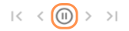
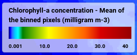
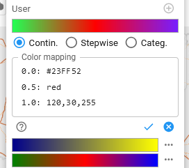

# Feature References

{: class="light-image" }
{: class="dark-image" }

A list of all the features that the viewer contains will be created here, in which the functionality of each one is explained in more detail.

## General Features

### Select Dataset

<table>
	<thead>
		<tr>
			<th colspan="2">
				
			</th>
		</tr>
	</thead>
	<tbody>
		<tr>
			<td><b>Feature Name</b></td>
			<td>Select Dataset</td>
		</tr>
		<tr>
			<td><b>Description</b></td>
			<td>
				A drop-down menu, which holds all available datasets. The selected dataset is
				highlighted and the dataset containing a 				
        <a href="../user_guide/analyse/#pin-variables" rel="noopener noreferrer"
					>pinned variable</a
				> 
        is marked with a <code>pin</code> icon.
			</td>
		</tr>
		<tr></tr>
		<tr>
			<td><b>Functionality</b></td>
			<td>
				The drop-down menu holds all datasets available on the server. When a
				new dataset is selected:
				<ul>
					<li>
						The first variable in the dataset is automatically selected,
						<b>or</b>
					</li>
					<li>
						If the new dataset contains a variable with the same name as the
						previously selected variable, that variable will be pre-selected.
					</li>
				</ul>
				Upon dataset selection the map can pan and zoom to the extent of the
				dataset. The map's zoom and pan behavior depends on the
				<a
					href="../user_guide/settings/#zoom-on-datasetvariable-selection"
					rel="noopener noreferrer"
					>user-defined settings</a
				>.
			</td>
		</tr>
		<tr>
			<td colspan="2">
				Link to feature mentioned in
				<a
					href="../user_guide/getting_started/#select-dataset-and-variables"
					rel="noopener noreferrer"
					>User Guide</a
				>.
			</td>
		</tr>
	</tbody>
</table>

### Locate Dataset in Map

<table>
	<thead>
		<tr>
			<th colspan="2">
				
			</th>
		</tr>
	</thead>
	<tbody>
		<tr>
			<td><b>Feature Name</b></td>
			<td>Locate Dataset</td>
		</tr>
		<tr>
			<td><b>Description</b></td>
			<td>Button</td>
		</tr>
		<tr></tr>
		<tr>
			<td><b>Functionality</b></td>
			<td>Pans and zooms to extent of selected dataset.</td>
		</tr>
	</tbody>
</table>

### Select Variable

<table>
	<thead>
		<tr>
			<th colspan="2">
				
			</th>
		</tr>
	</thead>
	<tbody>
		<tr>
			<td><b>Feature Name</b></td>
			<td>Select Variable</td>
		</tr>
		<tr>
			<td><b>Description</b></td>
			<td>
				A drop-down menu lists all variables in the dataset, ordered according
				to their sequence in the dataset.
				<a href="../user_guide/analyse/#user-variables" rel="noopener noreferrer"
					>User-defined variables</a
				>
				are marked with an icon and placed at the bottom of the list and the 				
        <a href="../user_guide/analyse/#pin-variables" rel="noopener noreferrer"
					>pinned variable</a
				> 
        is marked with a <code>pin</code> icon. The currently selected variable is highlighted.
			</td>
		</tr>
		<tr></tr>
		<tr>
			<td><b>Functionality</b></td>
			<td>
				Displays all variables available in the dataset, along with any
				user-defined variables.
			</td>
		</tr>
		<tr>
			<td><b>Aim</b></td>
			<td>Enable users to easily access and switch between variables.</td>
		</tr>
		<tr>
			<td colspan="2">
				Link to feature mentioned in
				<a
					href="../user_guide/getting_started/#select-dataset-and-variables"
					rel="noopener noreferrer"
					>User Guide</a
				>.
			</td>
		</tr>
	</tbody>
</table>

### Show/Hide Sidebar

<table>
	<thead>
		<tr>
			<th colspan="2">
				
			</th>
		</tr>
	</thead>
	<tbody>
		<tr>
			<td><b>Feature Name</b></td>
			<td>Show/Hide Sidebar</td>
		</tr>
		<tr>
			<td><b>Description</b></td>
			<td>Button, highlighted when feature is enabled</td>
		</tr>
		<tr></tr>
		<tr>
			<td><b>Functionality</b></td>
			<td>
				Shows or hides the
				<a href="#sidebar" rel="noopener noreferrer">Sidebar</a>.
			</td>
		</tr>
		<tr>
			<td><b>Aim</b></td>
			<td>
				Provides access to the
				<a href="#sidebar" rel="noopener noreferrer">Sidebar</a>.
			</td>
		</tr>
		<tr>
			<td colspan="2">
				Link to feature mentioned in
				<a
					href="../user_guide/getting_started/#sidebar"
					rel="noopener noreferrer"
					>User Guide</a
				>.
			</td>
		</tr>
	</tbody>
</table>

### Sidebar

<table>
	<thead>
		<tr>
			<th colspan="2">
				
			</th>
		</tr>
	</thead>
	<tbody>
		<tr>
			<td><b>Feature Name</b></td>
			<td>Sidebar</td>
		</tr>
		<tr>
			<td><b>Description</b></td>
			<td>
				A resizable window located at the right edge of the screen, which slides
				out when activated. At the top, a tab bar displays all available panels.
			</td>
		</tr>
		<tr></tr>
		<tr>
			<td><b>Functionality</b></td>
			<td>
				Open the sidebar by clicking the
				<a href="#showhide-sidebar" rel="noopener noreferrer"
					>corresponding button</a
				>, then select the panel of interest. The available panels depend on the
				specific deployment configuration.   
				<strong>Always Available Panels:</strong>
				<ul>
					<li>
						<strong>Info:</strong> Shows metadata and contextual information
						about datasets, variables, and places.
					</li>
					<li>
						<strong>Time Series:</strong> Allows visualization of time series
						data for selected variables and locations.
					</li>
					<li>
						<strong>Statistics:</strong> Provides statistical insights for
						datasets and places.
					</li>
				</ul>
				<strong>Optional Panels:</strong>
				<ul>
					<li>
						<strong>Volume:</strong> Visualizes 3D volumetric data (if enabled).
					</li>
					<li>
						<strong>User-Defined Panels:</strong> A planned feature for future
						versions of <em>xcube-viewer</em>, enabling user customization of
						panels.
					</li>
				</ul>
			</td>
		</tr>
		<tr>
			<td><b>Aim</b></td>
			<td>
				Provide an interactive space to explore, analyse, and visualise data
				through (configurable) panels.
			</td>
		</tr>
		<tr>
			<td colspan="2">
				Link to feature mentioned in
				<a
					href="../user_guide/getting_started/#sidebar"
					rel="noopener noreferrer"
					>User Guide</a
				>.
			</td>
		</tr>
	</tbody>
</table>

### Show/Hide Layer Panel

<table>
	<thead>
		<tr>
			<th colspan="2">
				
			</th>
		</tr>
	</thead>
	<tbody>
		<tr>
			<td><b>Feature Name</b></td>
			<td>Show/Hide Layer Panel</td>
		</tr>
		<tr>
			<td><b>Description</b></td>
			<td>Button, highlighted when feature is enabled</td>
		</tr>
		<tr></tr>
		<tr>
			<td><b>Functionality</b></td>
			<td>
				Shows or hides the
				<a href="#layer-panel" rel="noopener noreferrer">Layer Panel</a>.
			</td>
		</tr>
		<tr>
			<td><b>Aim</b></td>
			<td>Enable users to control the visibility of layers.</td>
		</tr>
		<tr>
			<td colspan="2">
				Link to feature mentioned in
				<a
					href="../user_guide/getting_started/#adjust-layer-visibilities"
					rel="noopener noreferrer"
					>User Guide</a
				>.
			</td>
		</tr>
	</tbody>
</table>

### Layer Panel

<table>
	<thead>
		<tr>
			<th colspan="2">
				
			</th>
		</tr>
	</thead>
	<tbody>
		<tr>
			<td><b>Feature Name</b></td>
			<td>Layer Panel</td>
		</tr>
		<tr>
			<td><b>Description</b></td>
			<td>
				A draggable window displaying a list of available layers, with options
				at the bottom to add user-defined basemaps or overlays. Visible layers
				are marked with a checkmark, while pinned variables are indicated by a
				pin icon.  This is the list of available layers in the Layers Panel:
				<ul>
					<li>the selected variable</li>
					<li>pinned variable (marked with an icon)</li>
					<li>user and dataset places</li>
					<li>base map and overlay</li>
					<li>the boundary box of the selected dataset</li>
					<li>the RGB of both the selected and pinned dataset</li>
				</ul>
			</td>
		</tr>
		<tr></tr>
		<tr>
			<td><b>Functionality</b></td>
			<td>
				Open the panel by using
				<a href="#showhide-layer-panel" rel="noopener noreferrer">the button</a>
				on the left side of the map and control the visibility of the available
				layers by clicking on them in the list.  Add or modify user
				variables or overlays at the bottom of the panel. Alternatively, that
				can also be done in the
				<a
					href="../user_guide/settings/#user-base-maps-and-overlays"
					rel="noopener noreferrer"
					>settings</a
				>.  
				Close the panel by by either clicking the <code>X</code> or the button
				again.
			</td>
		</tr>
		<tr>
			<td><b>Aim</b></td>
			<td>Enable users to control the visibility of layers.</td>
		</tr>
		<tr>
			<td colspan="2">
				Link to feature mentioned in
				<a
					href="../user_guide/getting_started/#adjust-layer-visibilities"
					rel="noopener noreferrer"
					>User Guide</a
				>.
			</td>
		</tr>
	</tbody>
</table>

### Enable Info Box

<table>
	<thead>
		<tr>
			<th colspan="2">
				
			</th>
		</tr>
	</thead>
	<tbody>
		<tr>
			<td><b>Feature Name</b></td>
			<td>Enable Info Box</td>
		</tr>
		<tr>
			<td><b>Description</b></td>
			<td>Button, highlighted when feature is enabled</td>
		</tr>
		<tr></tr>
		<tr>
			<td><b>Functionality</b></td>
			<td>
				Enables the
				<a href="#infobox" rel="noopener noreferrer">info box</a
				>.
			</td>
		</tr>
		<tr>
			<td><b>Aim</b></td>
			<td>Enable users to use the info box.</td>
		</tr>
		<tr>
			<td colspan="2">
				Link to feature mentioned in
				<a href="../user_guide/analysis/#infobox" rel="noopener noreferrer"
					>User Guide</a
				>.
			</td>
		</tr>
	</tbody>
</table>

### Information Box

<table>
	<thead>
		<tr>
			<th colspan="2">
				
			</th>
		</tr>
	</thead>
	<tbody>
		<tr>
			<td><b>Feature Name</b></td>
			<td>Information Box</td>
		</tr>
		<tr>
			<td><b>Description</b></td>
			<td>
				Displays an information box that provides pixel details for the area
				being hovered over. This includes latitude, longitude, the selected
				variable, and the pinned variable.
			</td>
		</tr>
		<tr></tr>
		<tr>
			<td><b>Functionality</b></td>
			<td>
				Enable the info box feature by using 
				<a href="#enable-info-box" rel="noopener noreferrer">the button</a>
				on the left side of the map and hover over the map to access pixel
				information.
			</td>
		</tr>
		<tr>
			<td><b>Aim</b></td>
			<td>Enable users to quickly access information about a pixel.</td>
		</tr>
		<tr>
			<td colspan="2">
				Link to feature mentioned in
				<a href="../user_guide/analyse/#infobox" rel="noopener noreferrer"
					>User Guide</a
				>.
			</td>
		</tr>
	</tbody>
</table>

### Zoom Information Box

<table>
	<thead>
		<tr>
			<th colspan="2">
				
			</th>
		</tr>
	</thead>
	<tbody>
		<tr>
			<td><b>Feature Name</b></td>
			<td>Zoom Information Box</td>
		</tr>
		<tr>
			<td><b>Description</b></td>
			<td>
	      Displays an information box that showing the current 
        zoom level of the map and the dataset resolution level (particularly 
        useful for multi-resolution dataset) used for displaying the dataset 
        in the map.
			</td>
		</tr>
		<tr></tr>
		<tr>
			<td><b>Functionality</b></td>
			<td>
        The visibility of this feature can be controlled in the 				
          <a
					href="../user_guide/settings"
					rel="noopener noreferrer"
					>settings</a
				>. 
        The initial visibility can be set in the Viewer configuration.
			</td>
		</tr>
		<tr>
			<td><b>Aim</b></td>
			<td>Enable users to quickly access information about the zoom and dataset
          level.
      </td>
		</tr>
	</tbody>
</table>

### Share Permalink

<table>
	<thead>
		<tr>
			<th colspan="2">
				
			</th>
		</tr>
	</thead>
	<tbody>
		<tr>
			<td><b>Feature Name</b></td>
			<td>Sidebar</td>
		</tr>
		<tr>
			<td><b>Description</b></td>
			<td>A button located in the header.</td>
		</tr>
		<tr></tr>
		<tr>
			<td><b>Functionality</b></td>
			<td>
				Click the button to generate a permalink and copy it to the clipboard.
				When using the feature, a pop-up window appears at the bottom of the
				viewer, indicating whether the permalink was created successfully.
				   
				This link can be shared with others to restore the current state of the
    			viewer, including:
    			<ul>
    				<li>The selected map region, zoom level, and overlays.</li>
    				<li>User-defined places, including the currently selected place.</li>
    				<li>Opened panels, active tabs, and any selected options.</li>
    				<li>
    					Other UI-specific states such as selected items, filters, or toggle
    					states.
    				</li>
    			</ul>
    		</td>
    	</tr>
    	<tr>
    		<td><b>Aim</b></td>
    		<td>To share the state of the viewer.</td>
    	</tr>
    	<tr>
    		<td colspan="2">
    			Link to feature mentioned in
    			<a
    				href="../user_guide/getting_started/#share-state-of-viewer"
    				rel="noopener noreferrer"
    				>User Guide</a
    			>.
    		</td>
    	</tr>
    </tbody>
</table>

## Compare Variables

### Pin Variables

<table>
	<thead>
		<tr>
			<th colspan="2">
				
			</th>
		</tr>
	</thead>
	<tbody>
		<tr>
			<td><b>Feature Name</b></td>
			<td>Pin Variable</td>
		</tr>
		<tr>
			<td><b>Description</b></td>
			<td>
				Button that is highlighted when the currently selected variable is the
				pinned variable.
			</td>
		</tr>
		<tr></tr>
		<tr>
			<td><b>Functionality</b></td>
			<td>
				Click the button to pin a variable. When a variable is pinned, the
				<a href="#split-mode" rel="noopener noreferrer">split mode</a> for
				visual comparison is automatically activated, if it hasn't been opened
				yet.  A variable can be unpinned by clicking the button again.
				If the variable should remain pinned but the split mode should be
				closed, the
				<a href="#split-mode" rel="noopener noreferrer">split mode</a> button
				must be clicked.
			</td>
		</tr>
		<tr>
			<td><b>Aim</b></td>
			<td>To pin variables for comparison.</td>
		</tr>
		<tr>
			<td colspan="2">
				Link to feature mentioned in
				<a
					href="../user_guide/analyse/#compare-variables"
					rel="noopener noreferrer"
					>User Guide</a
				>.
			</td>
		</tr>
	</tbody>
</table>

### Split Mode

<table>
	<thead>
		<tr>
			<th colspan="2">
				
			</th>
		</tr>
	</thead>
	<tbody>
		<tr>
			<td><b>Feature Name</b></td>
			<td>Split Mode</td>
		</tr>
		<tr>
			<td><b>Description</b></td>
			<td>
				A button, highlighted when the function is enabled. When the mode is
				activated, the screen is divided in the middle by a slidable line.
			</td>
		</tr>
		<tr></tr>
		<tr>
			<td><b>Functionality</b></td>
			<td>
				Start the comparison mode by using the button. The map is now split in
				the middle and the currently <strong>selected</strong> variable is
				displayed on the <strong>right side</strong> of the slidable line. If a
				variable is <strong>pinned</strong>, it is displayed on the
				<strong>left side</strong> of the screen along with its color bar.
				  
				The slidable line allows users to shift the view, enabling spatial
				comparison with underlying layers (e.g. basemaps, the pinned variable).
				The variable on the left can be made transparent to enhance the
				comparison.
				  
				<strong>Side note:</strong> The comparison mode is automatically
				activated when a variable is
				<a href="#pin-variables" rel="noopener noreferrer">pinned</a>.
			</td>
		</tr>
		<tr>
			<td><b>Aim</b></td>
			<td>
				Enables visual comparison of the selected variable with another (pinned
				variable) or with other layers, such as a user basemap or dataset RGB.
			</td>
		</tr>
		<tr>
			<td colspan="2">
				Link to feature mentioned in
				<a
					href="../user_guide/analyse/#compare-variables"
					rel="noopener noreferrer"
					>User Guide</a
				>.
			</td>
		</tr>
	</tbody>
</table>

## User Variables

### Open User Variable Management

<table>
	<thead>
		<tr>
			<th colspan="2">
				
			</th>
		</tr>
	</thead>
	<tbody>
		<tr>
			<td><b>Feature Name</b></td>
			<td>Open User Variable Management</td>
		</tr>
		<tr>
			<td><b>Description</b></td>
			<td>
				A button that opens a window for
				<a href="#user-variable-management" rel="noopener noreferrer"
					>managing user variables</a
				>.
			</td>
		</tr>
		<tr>
			<td><b>Aim</b></td>
			<td>To open user variable management menu.</td>
		</tr>
		<tr>
			<td colspan="2">
				Link to feature mentioned in
				<a href="../user_guide/analyse/#user-variables" rel="noopener noreferrer"
					>User Guide</a
				>.
			</td>
		</tr>
	</tbody>
</table>

### User Variable Management

<table>
	<thead>
		<tr>
			<th colspan="2">
				
			</th>
		</tr>
	</thead>
	<tbody>
		<tr>
			<td><b>Feature Name</b></td>
			<td>User Variable Management</td>
		</tr>
		<tr>
			<td><b>Description</b></td>
			<td>
				A window for managing user variables, that displays a list of all
				existing user variables, including their name, title, units, and
				expression. It also contains various buttons for managing user
				variables, as well as a button that opens an informational text
				regarding user variables.
			</td>
		</tr>
		<tr></tr>
		<tr>
			<td><b>Functionality</b></td>
			<td>
				Open the User Variable Management menu with
				<a href="#open-user-variable-management" rel="noopener noreferrer"
					>this button</a
				>
				in order to manage user variables with the following features:
				  
				When no variable is selected:
				<ul>
					<li>
						<a href="#add-user-variable" rel="noopener noreferrer"
							><strong>Add User Variable</strong></a
						>: To open a new window to create a user variable.
					</li>
				</ul>
				When a user variable is selected:
				<ul>
					<li>
						<a href="#add-user-variable" rel="noopener noreferrer"
							><strong>Add User Variable</strong></a
						>: To open a new window to create a user variable.
					</li>
					<li>
						<strong>Duplicate User Variable</strong>: To duplicate the selected
						variable, appending <code>_copy</code> to the title of the
						duplicate.
					</li>
					<li>
						<a href="#edit-user-variable" rel="noopener noreferrer"
							><strong>Edit User Variable</strong></a
						>: To open a window similar to the Add User Variable window for
						editing the selected variable.
					</li>
					<li>
						<strong>Remove User Variable</strong>: To remove the variable from the
						list.
					</li>
				</ul>
			</td>
		</tr>
		<tr>
			<td><b>Aim</b></td>
			<td>To manage user variables.</td>
		</tr>
		<tr>
			<td colspan="2">
				Link to feature mentioned in
				<a href="../user_guide/analyse/#user-variables" rel="noopener noreferrer"
					>User Guide</a
				>.
			</td>
		</tr>
	</tbody>
</table>

### Add User Variable

<table>
	<thead>
		<tr>
			<th colspan="2">
				
			</th>
		</tr>
	</thead>
	<tbody>
		<tr>
			<td><b>Feature Name</b></td>
			<td>Add User Variable</td>
		</tr>
		<tr>
			<td><b>Description</b></td>
			<td>
				A window that opens using the <code>+</code>-button in the User Variables
				Management menu. The window contains input fields for
				name, title, units, and expression. There is also an option to display
				various optional components of the expression.
			</td>
		</tr>
		<tr></tr>
		<tr>
			<td><b>Functionality</b></td>
			<td>
			Open this feature by using the
			<code>+</code
			>-button in the User Variables Management menu and fill in the fields to
			create a new variable.
			  
			To successfully add a variable, a valid
			<strong>name</strong>
			and a valid
			<strong>python expression</strong>
			must be provided. title and units are optional fields.
			<ul>
				<li>
					The <strong>name</strong> must be a unique identifier within the User
					Variables and must start with a letter.
				</li>
				<li>
					The <strong>expression</strong> is an algebraic expression that
					follows the syntax of python expressions.
				</li>
			</ul>
    		</td>
    	</tr>
    	<tr>
    		<td><b>Aim</b></td>
    		<td>To add user variables.</td>
    	</tr>
    	<tr>
    		<td colspan="2">
    			Link to feature mentioned in
    			<a href="../user_guide/analyse/#add" rel="noopener noreferrer"
    				>User Guide</a
    			>.
    		</td>
    	</tr>
    </tbody>
</table>

### Edit User Variable

<table>
	<thead>
		<tr>
			<th colspan="2">
				
			</th>
		</tr>
	</thead>
	<tbody>
		<tr>
			<td><b>Feature Name</b></td>
			<td>Edit User Variable</td>
		</tr>
		<tr>
			<td><b>Description</b></td>
			<td>
				A window that opens using the <code>Edit</code>-button in the User
				Variables Management menu. The window contains input fields for name,
        title, units, and expression. There is also an option to display various
        optional components of the expression. 
			</td>
		</tr>
		<tr>
			<td><b>Functionality</b></td>
			<td>
				See
				<a href="#add-user-variable" rel="noopener noreferrer"
					>add user variables</a
				>.
			</td>
		</tr>
		<tr>
			<td><b>Aim</b></td>
			<td>To edit user variables.</td>
		</tr>
		<tr>
			<td colspan="2">
				Link to feature mentioned in
				<a href="../user_guide/analyse/#edit" rel="noopener noreferrer"
					>User Guide</a
				>.
			</td>
		</tr>
	</tbody>
</table>

## Metadata

<table>
	<thead>
		<tr>
			<th colspan="2">
				
			</th>
		</tr>
	</thead>
	<tbody>
		<tr>
			<td><b>Feature Name</b></td>
			<td>Metadata</td>
		</tr>
		<tr>
			<td><b>Description</b></td>
			<td>
				Positioned in the sidebar, the metadata for the
				<strong>selected dataset, variable, or place</strong> is located under
				the "Details"-Tab. The <strong>display can be enabled</strong> using the
				buttons at the top left. When a display is enabled, the button's
				background appears highlighted in gray. 
				  
				Next to the displayed metadata information, three additional buttons
				control the <strong>format of the metadata</strong> display. Depending
				on the selected format, the enabled button's background is highlighted in
				gray.
			</td>
		</tr>
		<tr>
			<td><b>Functionality</b></td>
			<td>
				Open the sidebar and navigate to the "Details" tab to view the metadata.
				Enable the display for the object of interest: <strong>dataset, selected
				variable, or selected place</strong>. If no place is currently selected, the most
				recently selected place will be used. Then, choose the relevant metadata
				format:
				<ul>
					<li>
						<strong>Textual:</strong> A summary of properties in a
						human-readable format.
					</li>
					<li>
						<strong>Tabular:</strong> A complete list of attributes presented in
						a table.
					</li>
					<li>
						<strong>JSON:</strong> All attributes shown as machine-readable
						JSON.
					</li>
				</ul>
			</td>
		</tr>
		<tr>
			<td><b>Aim</b></td>
			<td>
				To provide metadata information for the dataset, the selected variable,
				or the selected place.
			</td>
		</tr>
		<tr>
			<td colspan="2">
				Link to feature mentioned in
				<a
					href="../user_guide/getting_started/#metadata"
					rel="noopener noreferrer"
					>User Guide</a
				>.
			</td>
		</tr>
				<tr>
			<td colspan="3" style="text-align: center;">
				
				
				
			</td>
		</tr>
    </tbody>
</table>

## Time Series

### Add Time Series

<table>
	<thead>
		<tr>
			<th colspan="2">
				
			</th>
		</tr>
	</thead>
	<tbody>
		<tr>
			<td><b>Feature Name</b></td>
			<td>Add time series/ Show time-series diagramm</td>
		</tr>
		<tr>
			<td><b>Description</b></td>
			<td>
				A button in the top toolbar with a graph icon, initially disabled. It
				becomes available only when a place is selected.
			</td>
		</tr>
		<tr>
			<td><b>Functionality</b></td>
			<td>
				A place must be selected for the feature to work. If not already
				open, the sidebar will open upon using this feature, displaying the time
				series data for the selected place. If no data is available for the
				selected place, an informational pop-up window displays the message:
				<code>No information data found here</code> along with a warning. And
				no time series will be added to the diagram.
			</td>
		</tr>
		<tr>
			<td><b>Aim</b></td>
			<td>
				Create a time series for the selected variable of a selected place.
			</td>
		</tr>
		<tr>
			<td colspan="2">
				Link to feature mentioned in
				<a href="../user_guide/analyse/#time-series" rel="noopener noreferrer"
					>User Guide</a
				>.
			</td>
		</tr>
	</tbody>
</table>

### Add Initial Time Series

<table>
	<thead>
		<tr>
			<th colspan="2">
				
			</th>
		</tr>
	</thead>
	<tbody>
		<tr>
			<td><b>Feature Name</b></td>
			<td>Initial Time Series</td>
		</tr>
		<tr>
			<td><b>Description</b></td>
			<td>
				The space under the "Time Series" tab in the sidebar varies depending on
				whether a time series graph is present. If no time series graph exists:
				A message indicates that no time series is currently displayed. Additionally 
				a button in the header is also available, which becomes active (with blue 
				font color) when a variable and place are selected and it is possible to 
				create a time series.
			</td>
		</tr>
		<tr>
			<td><b>Functionality</b></td>
			<td>
				Open the sidebar and navigate to the "Time Series". Select a place and a
				variable, then click the button to display a time series. Alternatively,
				the time series can be created using
				<a href="#add-time-series" rel="noopener noreferrer"
					>the button in the header</a
				>.
			</td>
		</tr>
		<tr>
			<td><b>Aim</b></td>
			<td>
				To create the initial time series graph for a selected place and
				variable in the sidebar.
			</td>
		</tr>
		<tr>
			<td colspan="2">
				Link to feature mentioned in
				<a href="../user_guide/analyse/#time-series" rel="noopener noreferrer"
					>User Guide</a
				>.
			</td>
		</tr>
	</tbody>
</table>

### Navigate Time Series Graphs

<table>
	<thead>
		<tr>
			<th colspan="2">
				
			</th>
		</tr>
	</thead>
	<tbody>
		<tr>
			<td><b>Feature Name</b></td>
			<td>Navigate Time Series Graphs</td>
		</tr>
		<tr>
			<td><b>Description</b></td>
			<td>
				A time series graph is displayed in the sidebar under the "Time Series"
				tab. Time series extracted from the same variable are displayed in a
				combined plot, allowing for easy comparison. A slider located at the top
				of the section to controll the displayed time range. Additionally,
				several features for navigating through the time series plot are
				conveniently positioned at the top right of the graph. The places for
				which time series have been extracted are listed below each plot,
				displaying the place name and coordinates if they are points.
			</td>
		</tr>
		<tr>
			<td><b>Functionality</b></td>
			<td>
				Open the sidebar and navigate to the "Time Series".
    			<ul>
    				<li>
    					Remove time series graphs of places by clicking the <code>-</code>-
    					button located below the plot next to the respective place. (h)
    				</li>
    				<li>Adjust the time range to focus on a specific period of interest.
						This applies to time series of different variables within a
						dataset (a)</li>
    				<li>Additionally, enable the buttons on the top right to:</li>
					<ul>
						<li>Reset everything back to the full scale (b)</li>
						<li>Zoom into the graph freely by pressing the Ctrl-key (c)</li>
						<li>Set a fixed y-scale for the graph (d)</li>
						<li>
							Hover over the graph to view detailed information for specific
							time steps via a popup info box (e)
						</li>
						<li>
							Display data with points, lines, or bars. For polygons or circles,
							you can also add the standard deviation to the graph (f)
						</li>
						<li>Copy a snapshot a time series to clipboard (g)</li>
					</ul>
    			</ul>
    		</td>
    	</tr>
    	<tr>
    		<td><b>Aim</b></td>
    		<td>
    			To provide a range of functions for investigating time series data.
    		</td>
    	</tr>
    	<tr>
    		<td colspan="2">
    			Link to feature mentioned in
    			<a href="../user_guide/analyse/#time-series" rel="noopener noreferrer"
    				>User Guide</a
    			>.
    		</td>
    	</tr>
    </tbody>

</table>

## Statistics

### Statistics Overview

<table>
	<thead>
		<tr>
			<th colspan="2">
				
			</th>
		</tr>
	</thead>
	<tbody>
		<tr>
			<td><b>Feature Name</b></td>
			<td>Statistics Overview</td>
		</tr>
		<tr>
			<td><b>Description</b></td>
			<td>
				This tab, located in the sidebar, lists all generated statistics with
				the most recent ones at the top. When a variable and place are selected,
				an option to generate statistics for them appears above the list of
				existing statistics. This option becomes active once a place is
				selected.
			</td>
		</tr>
		<tr>
			<td><b>Functionality</b></td>
			<td>
				Open the tab in the sidebar and add new statistics with the
				<code>+</code>-button and remove statistics using the
				<code>x</code>-button.
			</td>
		</tr>
		<tr>
			<td><b>Aim</b></td>
			<td>
				To provide a dedicated space to display, generate, and manage
				statistics.
			</td>
		</tr>
		<tr>
			<td colspan="2">
				Link to feature mentioned in
				<a href="../user_guide/analyse/#statistics" rel="noopener noreferrer"
					>User Guide</a
				>.
			</td>
		</tr>
	</tbody>
</table>

### Add Statistics

<table>
	<thead>
		<tr>
			<th colspan="2">
				
			</th>
		</tr>
	</thead>
	<tbody>
		<tr>
			<td><b>Feature Name</b></td>
			<td>Add Statistics</td>
		</tr>
		<tr>
			<td><b>Description</b></td>
			<td>
				A button in the top toolbar with a graph icon, initially disabled. It
				becomes active only when a location is selected.
			</td>
		</tr>
		<tr>
			<td><b>Functionality</b></td>
			<td>
				A place must be selected for the feature to work. If not already open,
				the sidebar will open upon using this feature, displaying the statistics
				for the selected place. If no data is available for the selected place,
				an informational pop-up window displays the message:
				<code>No information data found here</code> along with a warning. An
				empty table is shown in this case.
			</td>
		</tr>
		<tr>
			<td><b>Aim</b></td>
			<td>Create statistics for the selected variable of a selected place.</td>
		</tr>
		<tr>
			<td colspan="2">
				Link to feature mentioned in
				<a href="../user_guide/analyse/#statistics" rel="noopener noreferrer"
					>User Guide</a
				>.
			</td>
		</tr>
	</tbody>
</table>

### Statistics Display - Points

<table>
	<thead>
		<tr>
			<th colspan="2">
				
			</th>
		</tr>
	</thead>
	<tbody>
		<tr>
			<td><b>Feature Name</b></td>
			<td>Statistics Display Points</td>
		</tr>
		<tr>
			<td><b>Description</b></td>
			<td>
				Located in the <strong>Statistics</strong>-tab, a table displays the
				value at the selected point's coordinates for the selected variable.
				Above the table, details are shown, including the dataset, variable,
				time step, and place name.
			</td>
		</tr>
				<tr>
			<td><b>Functionality</b></td>
			<td>
				Open the tab in the sidebar and add new statistics with the
				<code>+</code>-button and remove statistics using the
				<code>x</code>-button.
			</td>
		</tr>
    	<tr>
    		<td><b>Aim</b></td>
    		<td>To display statistical information for places of type <code>Point</code>.</td>
    	</tr>
    	<tr>
    		<td colspan="2">
    			Link to feature mentioned in
    			<a href="../user_guide/analyse/#statistics" rel="noopener noreferrer"
    				>User Guide</a
    			>.
    		</td>
    	</tr>
    </tbody>
</table>

### Statistics Display - Polygons/Circles

<table>
	<thead>
		<tr>
			<th colspan="2">
				
			</th>
		</tr>
	</thead>
	<tbody>
		<tr>
			<td><b>Feature Name</b></td>
			<td>Statistics Display Polygons/Circles</td>
		</tr>
		<tr>
			<td><b>Description</b></td>
			<td>
				Located in the <strong>Statistics</strong>-tab, a table provides
				statistical values, including pixel count, minimum, maximum, mean, and
				standard deviation. A histogram displays these values, using the color
				associated with the place. Features to explore the statistics include:
				<ul>
					<li>Adjust the x-range of the histogram (a)</li>
					<li>Add the standard deviation to the histogram (b)</li>
					<li>Copy a snapshot of the statistics to clipboard (c)</li>
				</ul>
			</td>
		</tr>
		<tr>
			<td><b>Functionality</b></td>
			<td>
				Open the tab in the sidebar and add new statistics with the
				<code>+</code>-button and remove statistics using the
				<code>x</code>-button. Then, use the mentioned features to explore and
				work with the statistics
			</td>
		</tr>
		<tr>
			<td><b>Aim</b></td>
			<td>
				To display and explore statistical information for places of type
				<code>Polygon</code> or <code>Circle</code>.
			</td>
		</tr>
		<tr>
			<td colspan="2">
				Link to feature mentioned in
				<a href="../user_guide/analyse/#statistics" rel="noopener noreferrer"
					>User Guide</a
				>.
			</td>
		</tr>
	</tbody>
</table>

## Places

### Select Place Group

<table>
	<thead>
		<tr>
			<th colspan="2">
				
			</th>
		</tr>
	</thead>
	<tbody>
		<tr>
			<td><b>Feature Name</b></td>
			<td>Select Place Group</td>
		</tr>
		<tr>
			<td><b>Description</b></td>
			<td>
				A drop-down menu that lists place groups available on the server, along
				with a <code>My Places</code> group that contains all the places created
				in the Viewer. A selected group is marked with a checked checkbox and
				highlighted background.
			</td>
		</tr>
		<tr>
			<td><b>Functionality</b></td>
			<td>
				Select one or multiple groups in the drop-down menu by clicking on their
				names, which will be marked with a checkmark in the checkbox to display
				them on the map.
				  
				<strong>Side note:</strong> Selecting a group does not automatically
				adjust the map's view to the extent of the place group.
			</td>
		</tr>
		<tr>
			<td><b>Aim</b></td>
			<td>Manage visibility of place groups.</td>
		</tr>
		<tr>
			<td colspan="2">
				Link to feature mentioned in
				<a href="../user_guide/analyse/#select" rel="noopener noreferrer"
					>User Guide</a
				>.
			</td>
		</tr>
	</tbody>
</table>

### Select Place

<table>
	<thead>
		<tr>
			<th colspan="2">
				
			</th>
		</tr>
	</thead>
	<tbody>
		<tr>
			<td><b>Feature Name</b></td>
			<td>Select Place</td>
		</tr>
		<tr>
			<td><b>Description</b></td>
			<td>
				A drop-down menu that contains a list of all places within the selected
				place groups. The selected place is highlighted in the list.
			</td>
		</tr>
		<tr>
			<td><b>Functionality</b></td>
			<td>
				Select a place by clicking on it in the list. The selected place will be
				visually highlighted on the map with a yellow outline. The map
				automatically pans and zooms to the selected place, if selected in the
				<a
					href="../user_guide/settings.md/##zoom-on-datasetvariable-selection"
					rel="noopener noreferrer"
					>settings</a
				>.
			</td>
		</tr>
		<tr>
			<td><b>Aim</b></td>
			<td>Select and focus on a specific place.</td>
		</tr>
		<tr>
			<td colspan="2">
				Link to feature mentioned in
				<a href="../user_guide/analyse/#select" rel="noopener noreferrer"
					>User Guide</a
				>.
			</td>
		</tr>
	</tbody>
</table>

### Select Place in Map

<table>
	<thead>
		<tr>
			<th colspan="2">
				
			</th>
		</tr>
	</thead>
	<tbody>
		<tr>
			<td><b>Feature Name</b></td>
			<td>Select Place in Map</td>
		</tr>
		<tr>
			<td><b>Description</b></td>
			<td>A button that is highlighted when enabled.</td>
		</tr>
		<tr>
			<td><b>Functionality</b></td>
			<td>
				Select a place by clicking on it directly in the map. The selected place
				will be visually highlighted on the map with a yellow outline.
			</td>
		</tr>
		<tr>
			<td><b>Aim</b></td>
			<td>Select a place directly in the map.</td>
		</tr>
		<tr>
			<td colspan="2">
				Link to feature mentioned in
				<a href="../user_guide/analyse/#select" rel="noopener noreferrer"
					>User Guide</a
				>.
			</td>
		</tr>
	</tbody>
</table>

### Rename Place Group/ Place

<table>
	<thead>
		<tr>
			<th colspan="2">
				
			</th>
		</tr>
	</thead>
	<tbody>
		<tr>
			<td><b>Feature Name</b></td>
			<td>Rename Place Group/ Place</td>
		</tr>
		<tr>
			<td><b>Description</b></td>
			<td>A button located next to the drop-down menu.</td>
		</tr>
		<tr>
			<td><b>Functionality</b></td>
			<td>
				Provides the option to rename the selected place or place group.
				<strong>Important:</strong> Only place groups created within the
				Viewer and their associated places can be renamed.
			</td>
		</tr>
		<tr>
			<td><b>Aim</b></td>
			<td>Rename a place group or individual place.</td>
		</tr>
		<tr>
			<td colspan="2">
				Link to feature mentioned in
				<a href="../user_guide/analyse/#rename" rel="noopener noreferrer"
					>User Guide</a
				>.
			</td>
		</tr>
	</tbody>
</table>

### Remove Place Group/ Place

<table>
	<thead>
		<tr>
			<th colspan="2">
				
			</th>
		</tr>
	</thead>
	<tbody>
		<tr>
			<td><b>Feature Name</b></td>
			<td>Remove Place Group/ Place</td>
		</tr>
		<tr>
			<td><b>Description</b></td>
			<td>A button located next to the drop-down menu.</td>
		</tr>
		<tr>
			<td><b>Functionality</b></td>
			<td>
				Removes the selected place or place group.
				<strong>Important:</strong> Only place groups created within the
				Viewer and their associated places can be removed.
			</td>
		</tr>
		<tr>
			<td><b>Aim</b></td>
			<td>Remove a place group or individual place.</td>
		</tr>
		<tr>
			<td colspan="2">
				Link to feature mentioned in
				<a href="../user_guide/analyse/#remove" rel="noopener noreferrer"
					>User Guide</a
				>.
			</td>
		</tr>
	</tbody>
</table>

### Style Place

<table>
	<thead>
		<tr>
			<th colspan="2">
				
			</th>
		</tr>
	</thead>
	<tbody>
		<tr>
			<td><b>Feature Name</b></td>
			<td>Style Place</td>
		</tr>
		<tr>
			<td><b>Description</b></td>
			<td>
				A button that opens a small window for adjusting color and opacity.
				When clicking on the color box, a drop-down menu with a variety of
				colors appears. The opacity is controlled with a slider.
			</td>
		</tr>
		<tr>
			<td><b>Functionality</b></td>
			<td>
				Adjust the appearance (color and opacity) of the selected place in the
				window that appears when clicking the button. The changes are
				immediately reflected on the map. The selected color also determines the
				representation of points in <a href="#time-series" rel="noopener noreferrer"
					>time series chart</a
				>.
			</td>
		</tr>
		<tr>
			<td><b>Aim</b></td>
			<td>Change the appearance of a place.</td>
		</tr>
		<tr>
			<td colspan="2">
				Link to feature mentioned in
				<a href="../user_guide/analyse/#styling" rel="noopener noreferrer"
					>User Guide</a
				>.
			</td>
		</tr>
	</tbody>
</table>

### Locate Place in Map

<table>
	<thead>
		<tr>
			<th colspan="2">
				
			</th>
		</tr>
	</thead>
	<tbody>
		<tr>
			<td><b>Feature Name</b></td>
			<td>Locate Place in Map</td>
		</tr>
		<tr>
			<td><b>Description</b></td>
			<td>A button located next to the selection of places.</td>
		</tr>
		<tr>
			<td><b>Functionality</b></td>
			<td>Pans and zooms to the selected place on the map.</td>
		</tr>
		<tr>
			<td><b>Aim</b></td>
			<td>Locate the selected place on the map.</td>
		</tr>
	</tbody>
</table>

### Add Place

<table>
	<thead>
		<tr>
			<th colspan="2">
				
			</th>
		</tr>
	</thead>
	<tbody>
		<tr>
			<td><b>Feature Name</b></td>
			<td>Create Place</td>
		</tr>
		<tr>
			<td><b>Description</b></td>
			<td>A button that is highlighted when enabled.</td>
		</tr>
		<tr>
			<td><b>Functionality</b></td>
			<td>
				Click on one of the three buttons to create a new place directly in the
				map. The available geometry types are: <code>Point</code>,
				<code>Polygon</code>, and <code>Circle</code>. The newly created place
				is automatically set as the selected place. The names of places are
				chosen according to their geometry type and order, e.g.,
				<code>Circle 1</code>.   
				When creating a new place, a time series for the selected variable is
				created and displayed in the side bar automatically. If no data is
				available for the new place in the dataset, a pop-up window appears with
				the message:
				<code>No information data found here</code>.   
				<strong>Side note: </strong>When the feature is disabled,
				the
				<a href="#select-place-in-map" rel="noopener noreferrer"
					>Select place in map</a
				>
				mode is automatically enabled.
			</td>
		</tr>
		<tr>
			<td><b>Aim</b></td>
			<td>Create a place directly in the map.</td>
		</tr>
		<tr>
			<td colspan="2">
				Link to feature mentioned in
				<a href="../user_guide/analyse/#create" rel="noopener noreferrer"
					>User Guide</a
				>.
			</td>
		</tr>
	</tbody>
</table>

### Import Places

<table>
	<thead>
		<tr>
			<th colspan="2">
				
			</th>
		</tr>
	</thead>
	<tbody>
		<tr>
			<td><b>Feature Name</b></td>
			<td>Import Places</td>
		</tr>
		<tr>
			<td><b>Description</b></td>
			<td>
				A button that is highlighted when enabled and opens a window for
				importing places. In the window Supports importing places in various
				formats, including text/CSV, GeoJSON, and WKT.
			</td>
		</tr>
		<tr>
			<td><b>Functionality</b></td>
			<td>
				Open the feature by clicking on the button, then:
				  
				<ul>
					<li>
						Decide on the data format of the imported places (text/CSV, GeoJSON,
						or WKT)
					</li>
					<li>
						Import places through different methods:
						<ul>
							<li>
								<strong>Open from file:</strong> Opens a window to browse and
								select a file locally.
							</li>
							<li>
								<strong>Enter text:</strong> Manually input data into a text
								box.
							</li>
							<li>
								<strong>Drag & drop:</strong> Drag a file into the designated
								area to load it into the text box.
							</li>
						</ul>
					</li>
					<li>
						Remove the content of the text box with the
						<strong>Clear</strong>-button. This is only available when the box
						contains data.
					</li>
					<li>
						<strong>Options</strong>-button: Can be expanded to provide
						additional information and settings related to the import process.
					</li>
				</ul>
			</td>
		</tr>
		<tr>
			<td><b>Aim</b></td>
			<td>
				Enable import of places from various sources, making it easier to manage
				and display custom places within the Viewer.
			</td>
		</tr>
		<tr>
			<td colspan="2">
				Link to feature mentioned in
				<a href="../user_guide/analyse/#import" rel="noopener noreferrer"
					>User Guide</a
				>.
			</td>
		</tr>
	</tbody>
</table>

### Open Export Data Menu

<table>
	<thead>
		<tr>
			<th colspan="2">
				
			</th>
		</tr>
	</thead>
	<tbody>
		<tr>
			<td><b>Feature Name</b></td>
			<td>Open Export Data Menu</td>
		</tr>
		<tr>
			<td><b>Description</b></td>
			<td>
				A button that opens the
				<a href="#export-data" rel="noopener noreferrer"
					>Export Data</a
				> menu.
			</td>
		</tr>
		<tr>
			<td><b>Aim</b></td>
			<td>To open the Export Data menu.</td>
		</tr>
		<tr>
			<td colspan="2">
				Link to feature mentioned in
				<a href="../user_guide/analyse/#export" rel="noopener noreferrer"
					>User Guide</a
				>.
			</td>
		</tr>
	</tbody>
</table>

## Export Data

<table>
	<thead>
		<tr>
			<th colspan="2">
				
			</th>
		</tr>
	</thead>
	<tbody>
		<tr>
			<td><b>Feature Name</b></td>
			<td>Export Data</td>
		</tr>
		<tr>
			<td><b>Description</b></td>
			<td>
				A pop-up window that provides options for configuring the export
				settings for time series and place geometries.
			</td>
		</tr>
		<tr>
			<td><b>Functionality</b></td>
			<td>
				Open the export settings by using
				<a href="#open-export-data-menu" rel="noopener noreferrer"
					>this button</a
				>
				in the header of the Viewer and select options for export:
				<ul>
					<li>
						<strong>Include time series data</strong> (file format:
						<code>.txt</code>)
					</li>
					<li>
						<strong>Separator</strong> for time series data (default:
						<code>,</code>)
					</li>
					<li>
						<strong>Include place data</strong> (file format:
						<code>.geojson</code>)
					</li>
					<li><strong>Combine place data</strong> into a single file</li>
					<li>Export as a <strong>ZIP archive</strong></li>
					<li><strong>Filename</strong> configuration</li>
				</ul>
			</td>
		</tr>
		<tr>
			<td><b>Aim</b></td>
			<td>To export places and/or time series created within the Viewer.</td>
		</tr>
		<tr>
			<td colspan="2">
				Link to feature mentioned in
				<a href="../user_guide/analyse/#export" rel="noopener noreferrer"
					>User Guide</a
				>.
			</td>
		</tr>
	</tbody>
</table>

## Navigate Time Steps

### Select Time Steps (Calender)

<table>
	<thead>
		<tr>
			<th colspan="2">
				
			</th>
		</tr>
	</thead>
	<tbody>
		<tr>
			<td><b>Feature Name</b></td>
			<td>Select Time Step (Calender)</td>
		</tr>
		<tr>
			<td><b>Description</b></td>
			<td>A button that opens a calendar window when enabled.</td>
		</tr>
		<tr>
			<td><b>Functionality</b></td>
			<td>
				The button opens a calendar window when clicked. Click on a date in the
				calendar, to select and display the time step that is closest to the
				chosen date.  
				The time resolution (HH:MM:SS) is not supported yet, but it will be
				displayed in the calendar view if the resolution is available in the
				dataset.
			</td>
		</tr>
		<tr>
			<td><b>Aim</b></td>
			<td>
				Easily navigate and select specific time steps within a dataset using a
				visual calendar interface.
			</td>
		</tr>
		<tr>
			<td colspan="2">
				Link to feature mentioned in
				<a
					href="../user_guide/analyse/#navigate-through-time"
					rel="noopener noreferrer"
					>User Guide</a
				>.
			</td>
		</tr>
	</tbody>
</table>

### Select Time Steps (Slider)

<table>
	<thead>
		<tr>
			<th colspan="2">
				
			</th>
		</tr>
	</thead>
	<tbody>
		<tr>
			<td><b>Feature Name</b></td>
			<td>Select Time Step (Slider)</td>
		</tr>
		<tr>
			<td><b>Description</b></td>
			<td>
				A time slider to navigate through the time steps of the selected
				variable. The slider is labeled with the first and last time steps of
				the dataset at the start and end points.
			</td>
		</tr>
		<tr>
			<td><b>Functionality</b></td>
			<td>Move the slider to select and display the desired time step.</td>
		</tr>
		<tr>
			<td><b>Aim</b></td>
			<td>Easily navigate and explore time steps within a dataset.</td>
		</tr>
		<tr>
			<td colspan="2">
				Link to feature mentioned in
				<a
					href="../user_guide/analyse/#navigate-through-time"
					rel="noopener noreferrer"
					>User Guide</a
				>.
			</td>
		</tr>
	</tbody>
</table>

### +/- 1 Time Step

<table>
	<thead>
		<tr>
			<th colspan="2">
				
			</th>
		</tr>
	</thead>
	<tbody>
		<tr>
			<td><b>Feature Name</b></td>
			<td>Move to +/- 1 Time Step</td>
		</tr>
		<tr>
			<td><b>Description</b></td>
			<td>
				Buttons, designed according to its function, allowing to navigate to
				either the previous or next time step of the dataset.
			</td>
		</tr>
		<tr>
			<td><b>Functionality</b></td>
			<td>
				Click the buttons to move to the previous/next time step in the dataset
				and display the corresponding data on the map.
			</td>
		</tr>
		<tr>
			<td><b>Aim</b></td>
			<td>
				Quick navigation option to access the previous and next time steps in
				the dataset.
			</td>
		</tr>
		<tr>
			<td colspan="2">
				Link to feature mentioned in
				<a
					href="../user_guide/analyse/#navigate-through-time"
					rel="noopener noreferrer"
					>User Guide</a
				>.
			</td>
		</tr>
	</tbody>
</table>

### First/Last Time Step

<table>
	<thead>
		<tr>
			<th colspan="2">
				
			</th>
		</tr>
	</thead>
	<tbody>
		<tr>
			<td><b>Feature Name</b></td>
			<td>Move to first/last Time Step</td>
		</tr>
		<tr>
			<td><b>Description</b></td>
			<td>
				Buttons, designed according to its function, allowing to navigate to
				either the first or last time step of the dataset.
			</td>
		</tr>
		<tr>
			<td><b>Functionality</b></td>
			<td>
				Click the buttons to move to the first/last time step in the dataset and
				display the corresponding data on the map.
			</td>
		</tr>
		<tr>
			<td><b>Aim</b></td>
			<td>
				Quick navigation option to access the first and last time steps in the
				dataset.
			</td>
		</tr>
		<tr>
			<td colspan="2">
				Link to feature mentioned in
				<a
					href="../user_guide/analyse/#navigate-through-time"
					rel="noopener noreferrer"
					>User Guide</a
				>.
			</td>
		</tr>
	</tbody>
</table>

### Auto-step

<table>
	<thead>
		<tr>
			<th colspan="2">
				
				
			</th>
		</tr>
	</thead>
	<tbody>
		<tr>
			<td><b>Feature Name</b></td>
			<td>Auto-step</td>
		</tr>
		<tr>
			<td><b>Description</b></td>
			<td>
				A button that changes its appearance when the feature is activated,
				while disabling the buttons used to navigate through time steps.
			</td>
		</tr>
		<tr>
			<td><b>Functionality</b></td>
			<td>
				When enabled, the feature iterates through the time steps sequentially,
				displaying each step in the Viewer. The speed or interval of this
				iterating can be configured in the 						<a
							href="../user_guide/settings/#player-interval"
							rel="noopener noreferrer"
							>settings</a
						>. Click the button again to
				pause.
			</td>
		</tr>
		<tr>
			<td><b>Aim</b></td>
			<td>Engaging way to visually explore multiple time steps.</td>
		</tr>
		<tr>
			<td colspan="2">
				Link to feature mentioned in
				<a href="../user_guide/analyse/#the-player" rel="noopener noreferrer"
					>User Guide</a
				>.
			</td>
		</tr>
	</tbody>
</table>

## Color Mapping

### Legend

<table>
	<thead>
		<tr>
			<th colspan="2">
				
			</th>
		</tr>
	</thead>
	<tbody>
		<tr>
			<td><b>Feature Name</b></td>
			<td>Legend</td>
		</tr>
		<tr>
			<td><b>Description</b></td>
			<td>
				Displays the current color map, the value range, and the long name of
				the variable along with its units (these details are extracted from the
				dataset). The color mapping is selected automatically based on the
				configuration in xcube Server. The value range and color bar are hidden
				buttons, providing access to adjust the value range and
				color map.
			</td>
		</tr>
		<tr>
			<td><b>Functionality</b></td>
			<td>
				The legend is interactiv:
				<ul>
				<li>
					Click on the color map open the
					<a href="#color-map-menu" rel="noopener noreferrer"
						>Color Mapping Menu</a
					>.
				</li>
				<li>
					Click on the ticks of the
					<a href="#value-range" rel="noopener noreferrer">value range</a> to
					adjust the range via a small pop-up window.
				</li>
				</ul>
			</td>
		</tr>
		<tr>
			<td><b>Aim</b></td>
			<td>
				Display the color mapping of the current variable and provide access
				to further adjustments regarding the color mapping.
			</td>
		</tr>
		<tr>
			<td colspan="2">
				Link to feature mentioned in
				<a href="../user_guide/colormaps/" rel="noopener noreferrer">User Guide</a
				>.
			</td>
		</tr>
	</tbody>
</table>

### Value Range

<table>
	<thead>
		<tr>
			<th colspan="2">
				
			</th>
		</tr>
	</thead>
	<tbody>
		<tr>
			<td><b>Feature Name</b></td>
			<td>Adjust Value Range</td>
		</tr>
		<tr>
			<td><b>Description</b></td>
			<td>
				A window that opens when clicking on the value range of the color bar in the legend,
				to adjust the settings of the value range.
				 This includes:
				<ul>
					<li>
						A slider to manually adjust the
						<strong>minimum and maximum</strong> values.
					</li>
					<li>
						Text fields to enter <strong>minimum and maximum</strong> values.
					</li>
					<li>
						A toggle button on the top-right corner to enable
						<strong>log-scaling</strong>.
					</li>
					<li>
						A toggle button for applying the value range of the color map. This
						feature is only available if the <strong>color map</strong> has an
						<strong>assigned value range</strong>.
					</li>
				</ul>
    		</td>
    	</tr>
    	<tr>
    		<td><b>Functionality</b></td>
    		<td>
				Open the feature by clicking on the legend area where the value ticks
				are shown. Then use the available features to adjust the edges of the
				value range, to use a log-scaling or to apply the assigned value range
				of the color map.
    		</td>
    	</tr>
    	<tr>
    		<td><b>Aim</b></td>
    		<td>
    			Adjust the value range of the current color mapping .
    		</td>
    	</tr>
    	<tr>
    		<td colspan="2">
    			Link to feature mentioned in
    			<a
    				href="../user_guide/colormaps/#adjust-the-value-range"
    				rel="noopener noreferrer"
    				>User Guide</a
    			>.
    		</td>
    	</tr>
    </tbody>

</table>

### Color Map Menu

<table>
	<thead>
		<tr>
			<th colspan="2">
				
			</th>
		</tr>
	</thead>
	<tbody>
		<tr>
			<td><b>Feature Name</b></td>
			<td>Color Map Menu</td>
		</tr>
		<tr>
			<td><b>Description</b></td>
			<td>
				A window that opens when clicking on the color bar in the legend. This
				menu provides:
				<ul>
					<li>access to custom colormap management</li>
					<li>a list of already available color maps</li>
					<li>options for hiding small values (button)</li>
					<li>options for adjusting opacity (slider)</li>
					<li>options for reversing the color map (button) (button)</li>
				</ul>
			</td>
		</tr>
		<tr>
			<td><b>Functionality</b></td>
			<td>
				Open the menu by clicking on the colormap in the legend. Then use the
				menu to access
				<a href="#custom-color-maps" rel="noopener noreferrer"
					>custom colormap management</a
				>, select new colormaps or adjust the currently selected.
			</td>
    	</tr>
    	<tr>
    		<td><b>Aim</b></td>
    		<td>
    			Manage custom color maps, change, adjust and modify the current color
    			mapping.
    		</td>
    	</tr>
    	<tr>
    		<td colspan="2">
    			Link to feature mentioned in
    			<a
    				href="../user_guide/colormaps/#change-or-create-color-maps"
    				rel="noopener noreferrer"
    				>User Guide</a
    			>.
    		</td>
    	</tr>
    </tbody>

</table>

### Custom Color Maps

<table>
	<thead>
		<tr>
			<th colspan="2">
				
			</th>
		</tr>
	</thead>
	<tbody>
		<tr>
			<td><b>Feature Name</b></td>
			<td>Custom Color Maps</td>
		</tr>
		<tr>
			<td><b>Description</b></td>
			<td>
				A small workspace that appears when clicking the <code>+</code>-button
				in the Color Mapping Menu or when editing an existing custom color map.
				Displayed at the top is the color bar, then there is the option to
				select the color map type followed by a text field where users can
				define or edit the color map.
			</td>
		</tr>
		<tr>
			<td><b>Functionality</b></td>
			<td>
				Access the Custom Color Map workspace by using the <code>+</code>-button
				in the
				<a href="#color-map-menu" rel="noopener noreferrer"
					>Color Mapping Menu</a
				>
				or entering the editing mode for custom color maps. In the workspace:
				<ul>
					<li>
						Decide on the color mapping type (continious, stepwise,
						categorical).
					</li>
					<li>
						In the text box, define the mapping using the general syntax
						<code>&lt;value&gt;: &lt;color&gt;</code>.
					</li>
				</ul>
			</td>
		</tr>
		<tr>
			<td><b>Aim</b></td>
			<td>Select, create, edit or delete custom color maps.</td>
		</tr>
		<tr>
			<td colspan="2">
				Link to feature mentioned in
				<a
					href="../user_guide/colormaps/#user-defined-color-maps"
					rel="noopener noreferrer"
					>User Guide</a
				>.
			</td>
		</tr>
	</tbody>
</table>
