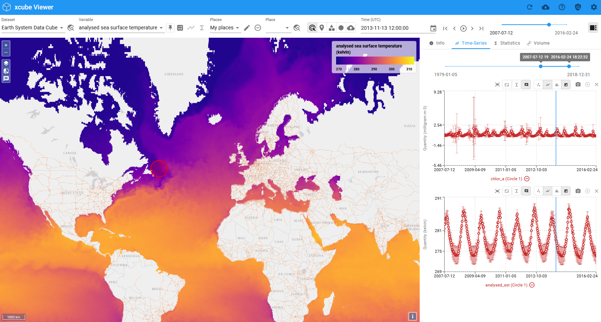

---
hide:
  - toc
---

# xcube Viewer Documentation

Welcome to the **xcube Viewer** documentation page. The xcube Viewer is a single-page web application that provides tools to visualise and analyse multitemporal spatial datasets. The data is provided via the [xcube Server](https://xcube.readthedocs.io/en/latest/webapi.html).

