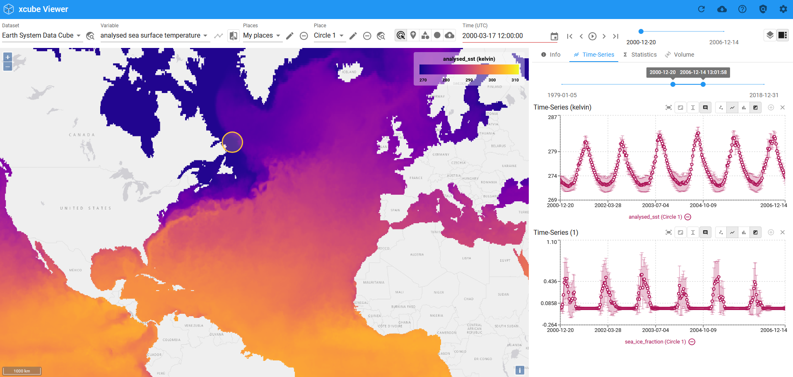

---
hide:
  - toc
---

# xcube Viewer Documentation

Welcome to the **xcube Viewer** documentation page. The xcube Viewer is a single-page web application that provides tools to visualise and analyse multitemporal spatial datasets. The data is provided via the [xcube Server](https://xcube.readthedocs.io/en/latest/webapi.html).

## General Concepts and Features

The features of the Viewer include:

- **Visualisation** of multitemporal spatial datasets
- **Comparison** (visual) of two variables of two or the same dataset
- **Statistics or Time Series** for multiple points or areas in the datasets
- **Generation** of user-defined variables
- **Player** to iterate through time steps of a multitemporal dataset
- **External Services** (WMS etc.) to add as overlays and basemaps
