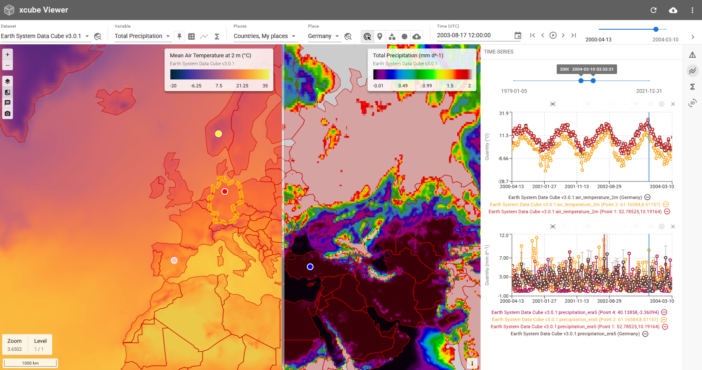
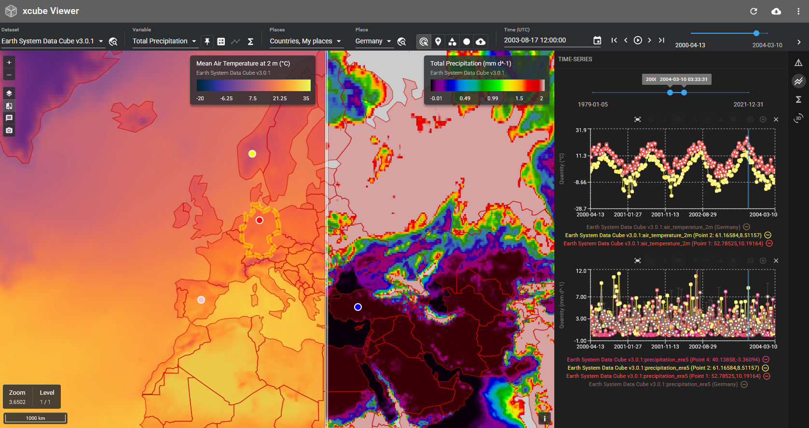

---
hide:
  - toc
---

# xcube Viewer Documentation

{: class="light-image" }
{: class="dark-image" }

**xcube Viewer** is a single-page web application for exploring data cubes served by
[xcube Server](https://xcube.readthedocs.io/en/latest/webapi.html). It provides
map-based data browsing, time navigation, variable comparison, statistics,
time-series extraction, colour mapping, and tools for working with places.

The Viewer can be used as a lightweight tool for inspecting data locally or as a
deployed application for sharing data with others. Viewer instances can be
adapted to your data, branding, map setup, and available features, and extended
with custom user panels using [chartlets](build_viewer/panels.md).

xcube Viewer is an open source project. This documentation is organised for two
main paths: using an existing Viewer deployment, or setting up and customising a
local or public Viewer yourself.

<a class="viewer-docs-card viewer-docs-card-primary" href="user_guide/">
  Use the Viewer
  <strong>User Guide</strong>
  
        Learn how to navigate a Viewer deployment and use features such as
        comparison mode, user variables, and statistics.
  
</a>

<a class="viewer-docs-card viewer-docs-card-secondary" href="build_viewer/">
  Run your own
  <strong>Get your own Viewer</strong>
  
        Learn how to use, configure, deploy, and extend a Viewer for your own
        data.
  
</a>

## References

- [General concepts](concepts.md): Learn the key terms used throughout the documentation, including datasets, variables, places, layers, and Viewer state.
- [Feature references](features.md): Look up individual Viewer controls and UI elements when you need a quick, focused explanation.
- [xcube Server Web API](https://xcube.readthedocs.io/en/latest/webapi.html): The Viewer visualises and analyses data provided by an xcube Server instance.
