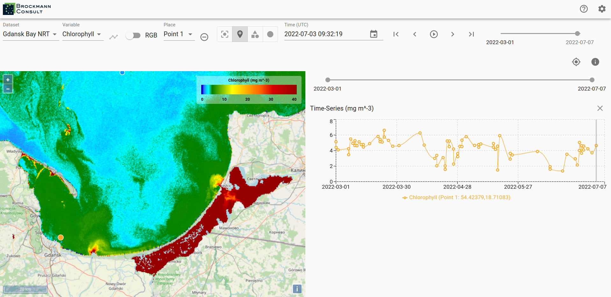
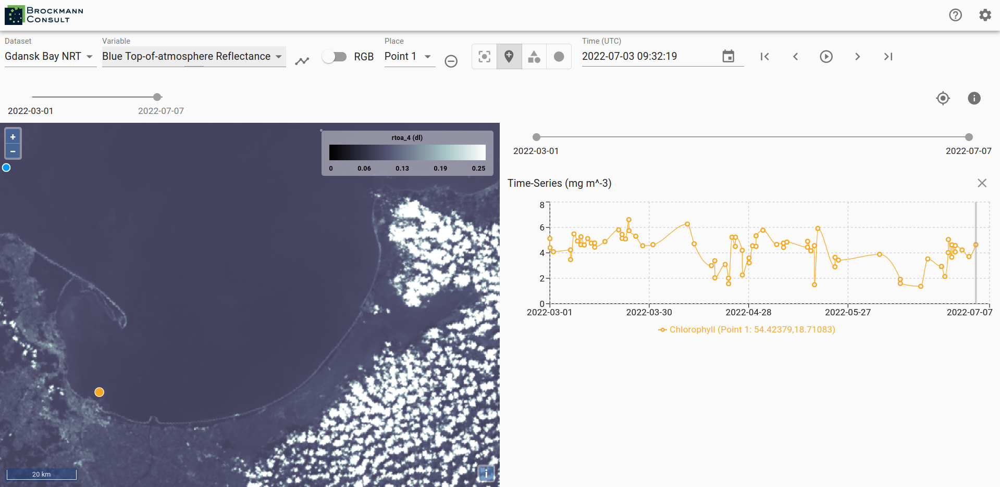
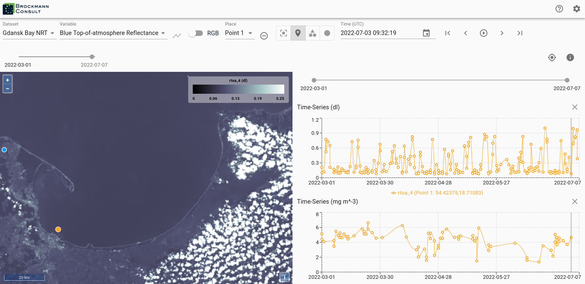
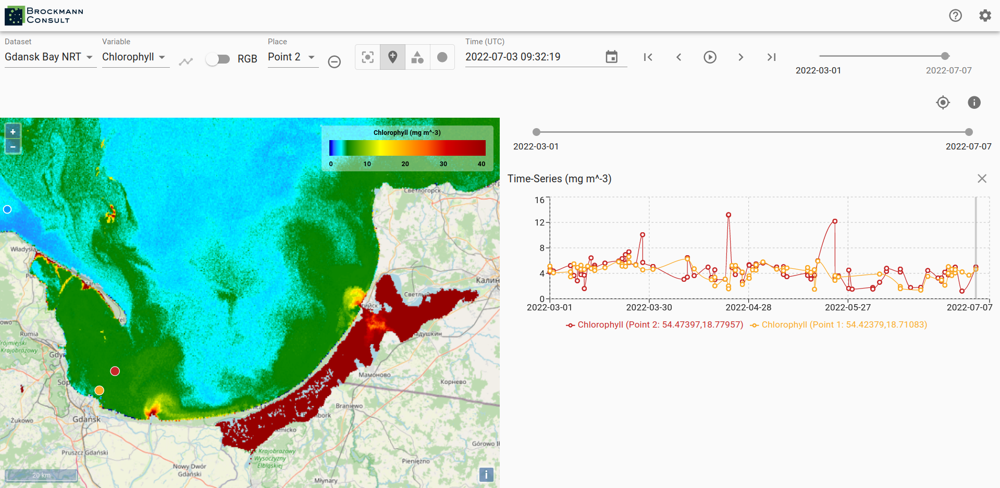
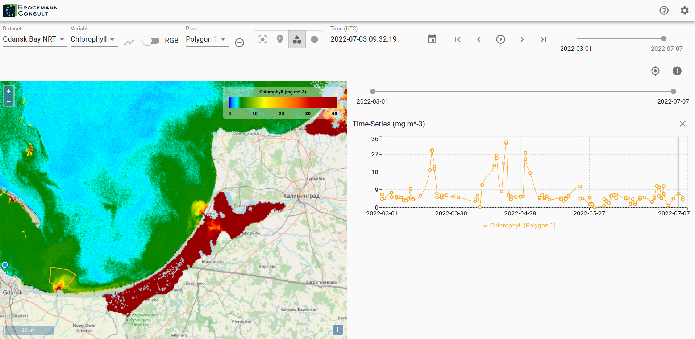
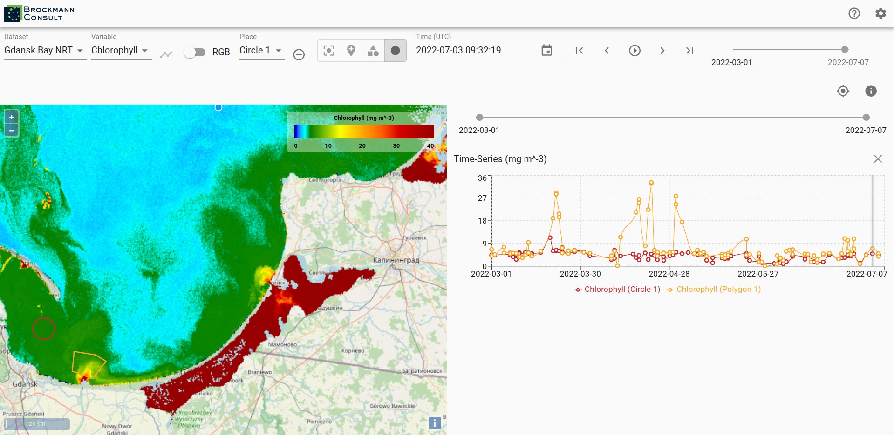
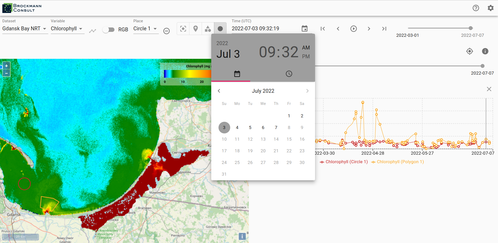
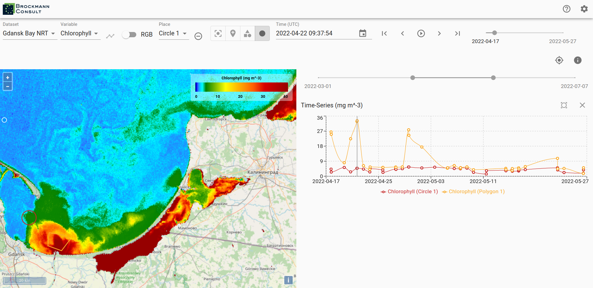

# Analyse Variables

To obtain a time series set a point marker on the map and then select the _graph_-icon next to the _Variables_ drop-down
menu. You can select a different date by clicking into the time series graph on a value of interest. The data displayed
in the viewer changes accordingly to the newly selected date.

The current date is preserved when you select a different variable and the data of the variable is mapped for the date.

To generate a time series for the newly selected variable press the _time series_-icon again.

You may place multiple points on the map and you can generate time series for them. This allows a comparison between
two locations. The color of the points corresponds to the color of the graph in the time series. You can find the
coordinates of the point markers visualized in the time series beneath the graphs.

To delete a created location use the _remove_-icon next to the _Place_ drop-down menu.
Not only point location may be selected via the viewer, you can draw polygons and circular areas by using the icons on
the right-hand side of the _Place_ drop-down menu as well. You can visualize time series for areas, too.

In order to change the date for the data display use the calendar or step through the time line with the
arrows on the right-hand side of the calendar.

When a time series is displayed two time-line tools are visible, the upper one for selecting the date displayed
on the map of the viewer and the lower one may be used to narrow the time frame displayed in the time series graph.
Just above the graph of the time series on the right-hand side is an _x_-icon for removing the time series from the
view and to left of it is an icon which sets the time series back to the whole time extent.

