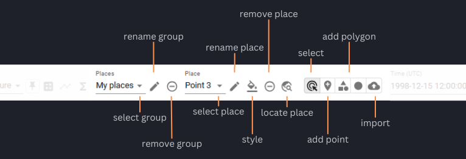

# Analyse Variables

## Infobox

Enable a small pixel information box being displayed
next to the pointer when hovering over the map. It shows the current
map coordinates and the values of the currently selected variable at
that position. The feature is switched on and off from the layer
selector menu on the left.

---

## Time-Series, Statistics, Volume

### Time-Series

To obtain a time series set a point marker on the map and then select the _graph_-icon next to the _Variables_ drop-down
menu. You can select a different date by clicking into the time series graph on a value of interest. The data displayed
in the viewer changes accordingly to the newly selected date.

The current date is preserved when you select a different variable and the data of the variable is mapped for the date.

To generate a time series for the newly selected variable press the _time series_-icon again.

You may place multiple points on the map and you can generate time series for them. This allows a comparison between
two locations. The color of the points corresponds to the color of the graph in the time series. You can find the
coordinates of the point markers visualized in the time series beneath the graphs.

When a time series is displayed two time-line tools are visible, the upper one for selecting the date displayed
on the map of the viewer and the lower one may be used to narrow the time frame displayed in the time series graph.
Just above the graph of the time series on the right-hand side is an _x_-icon for removing the time series from the
view and to left of it is an icon which sets the time series back to the whole time extent.

## 

To delete a created location use the _remove_-icon next to the _Place_ drop-down menu.
Not only point location may be selected via the viewer, you can draw polygons and circular areas by using the icons on
the right-hand side of the _Place_ drop-down menu as well. You can visualize time series for areas, too.

### Statistics

### Volume

### Export Statistics

---

## User Variables

Define your own variables computed from Python-like expressions. The expressions can combine other variables of the current dataset using almost all Python operators and all [numpy universal functions](https://numpy.org/doc/stable/reference/ufuncs.html#available-ufuncs). User data variables are persisted in the browser's local storage.

???+ info "In more detail"

    A _user variable_ is a variable that is defined by a _name_, _title_, _units_,
    and by an algebraic _expression_ that is used to compute the variable's array
    data. User variables are added to the currently selected dataset and their
    expressions are evaluated in the context of the selected dataset.

    **Name**: A name that is unique within the selected dataset's variables.
    The name must start with a letter optionally followed by letters or digits.

    **Title**: Optional display name of the variable in the user interface.

    **Units**: Optional physical units of the computed data values.
    For example, units are used to group time-series.

    **Expression**: An algebraic expression used to compute the variable's data
    values. The syntax is that of [Python expressions](https://docs.python.org/3/reference/expressions.html).
    The expression may reference the following names:

    - the current dataset's data variables;
    - the numpy constants `e`, `pi`, `nan`, `inf`;
    - all [numpy ufunc](https://numpy.org/doc/stable/reference/ufuncs.html)
    functions;
    - the [`where`](https://docs.xarray.dev/en/stable/generated/xarray.where.html) function.

    The majority of Python numerical and logical operators are supported,
    however, the logical operators `and`, `or`, and `not` cannot be used with
    array variables as they require boolean values as operands. Use the bitwise
    operators `&`, `|`, `~` instead or use the
    corresponding functions `logical_and()`, `logical_or()`, and `logical_not()`.
    Python built-in functions such as `min()` and `max()` are not supported,
    use `fmin()` and `fmax()` instead.

    Expression examples:

    - Mask out where a variable `chl` is lower than zero: `where(chl >= 0, chl, nan)`
    - Sentinel-2 vegetation index or NDVI: `(B08 - B04) / (B08 + B04)`
    - Sentinel-2 moisture index: `(B8A - B11) / (B8A + B11)`

    Invalid expressions return an error message.

    CTRL+SPACE: activates the autocomplete feature, which lists
    available Python functions and constants

---

## Compare Variables

Visually compare two variables using **Compare Mode**. This mode displays two variables side by side, with a slider in the middle that can be adjusted.

To **enter** Compare Mode:

1. Pin a variable, which will be displayed on the left. This will automatically activate Compare Mode.
2. Select a second variable for comparison, which will be displayed on the right.

To **exit** Compare Mode: use the button on the left

---

## Navigate through time

{: class="light-image" }
{: class="dark-image" }

Use the showen features of the Viewer to navigate through the time steps of a variable. Select a specific date in the calendar view, move through the dataset time step by time step, jump to the beginning or end of the dataset, move the slider on the bar to select a time step, or start the player.

### The Player

Use the Player to auto-step through the variable of a dataset. The interval can be adjusted in the [settings](settings.md/#time-series).

---

## Places

**Places** provide a spatial reference for extracting statistical values and time series data. They can be represented as either `points` or `polygons/circles`.

There are two types of Places:

- **Dataset Places:** These are part of the dataset and are hosted on the xcube server.
- **User-defined Places:** These can be imported or created directly in the Viewer.

Places are organized into **groups** which hold individial places.

The Viewer offers a variety of features (such as adding, removing, and styling) for working with Places to obtain statistical information. The following sections will explain the available features

{: class="light-image" }
{: class="dark-image" }

### Create

New Places can be **created** in the Viewer using the buttons in the header, with `points` and `polygons/circles` being the available geometry types.

### Import

Already created places can also be **imported**. The allowed formats are `text/csv`, `GeoJSON` and `WKT`. When importing a CSV table or a GeoJSON object, user can specify the time column name or time property. If given, time values are expected to be UTC and use ISO format.

### Select

Place groups and individual places can be **selected** through a drop-down menu. Additionally, single places can be chosen by clicking on them with the mouse when the corresponding function is enabled. Selected places are marked with a yellow ring around them.

### Remove

**Remove** Place groups or Places by selecting the group or object and deleting it via the button in the header.

### Rename

Place Groups and individial places can also be **renamed** in the Viewer via the according buttons.

### Styling

Modify both the color and opacity of a Place. The selected color will be reflected consistently in the Time Series chart.

### Export user-defined places

The geometry of Places created in the Viewer can be exported. This can be applied during [the export of statistical data](#export-statistics). To include the geometry information in the export, it must be explicitly selected.

