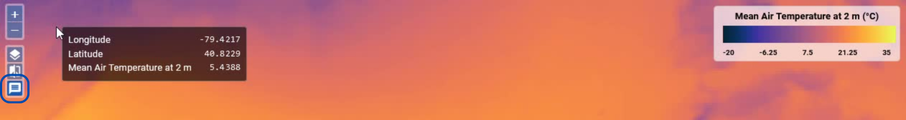

# Analyse Variables

## Infobox

Enable a small pixel information box being displayed
next to the pointer when hovering over the map. It shows the current
map coordinates and the values of the currently selected variable at
that position. The feature is switched on and off from the layer
selector menu on the left.

---

## Extract Information

The Viewer provides the ability to extract information from variables at specific [places](#places) (point, circle, or polygon), in the form of time series and basic statistics. All extracted information is displayed on the right side of the Viewer in the sidebar.

### Time-Series

When adding a new place to the map, a time series will automatically be extracted and displayed by default. If the place already exists, simply select it and use the _graph_-icon next to the Variables drop-down menu. To remove a place from a graph, click the `-`-icon next to the place listed below the graph. The color of the places corresponds to the color of the graph in the time series. You can find the coordinates of the places visualized in the time series beneath the graphs.

There are multiple options to explore the graph:

- Adjust the time range to focus on a specific period of interest. This applies to time series of different variables within a dataset
- Display data with points, lines, or bars. For polygons or circles, you can also add the standard deviation to the graph
- Hover over the graph to view detailed information for specific time steps via a popup info box
- Zoom into the graph freely by pressing the `Ctrl`-key
- Set a fixed y-scale for the graph
- Reset everything back to the full scale
- Copy a snapshot a time series to clipboard

#### Export time series

Export the time series using the option in the header at the top right. You have the option to export the time series, the geometries of the Places, or both.

### Statistics

Compute and display basic statistics for the currently selected variable, selected timestamp, and selected place. To obtain the statistics select a place and compute by using the $\Sigma$ -icon next to the Variables drop-down menu or use the `+`-icon under the Statistics Tab in the sidebar.

If the place is an area:

- Statistics include minimum, maximum, mean, standard deviation, and a histogram
- Adjust the x-range of the histogram
- Add the standard deviation to the histogram
- Copy a snapshot of the statistics to clipboard

For point places:

- the value at the point is displayed

---

## User Variables

Define your own variables computed from Python-like expressions. The expressions can combine other variables of the current dataset using almost all Python operators and all [numpy universal functions](https://numpy.org/doc/stable/reference/ufuncs.html#available-ufuncs). User data variables are persisted in the browser's local storage.

???+ info "In more detail"

    A _user variable_ is a variable that is defined by a _name_, _title_, _units_,
    and by an algebraic _expression_ that is used to compute the variable's array
    data. User variables are added to the currently selected dataset and their
    expressions are evaluated in the context of the selected dataset.

    **Name**: A name that is unique within the selected dataset's variables.
    The name must start with a letter optionally followed by letters or digits.

    **Title**: Optional display name of the variable in the user interface.

    **Units**: Optional physical units of the computed data values.
    For example, units are used to group time-series.

    **Expression**: An algebraic expression used to compute the variable's data
    values. The syntax is that of [Python expressions](https://docs.python.org/3/reference/expressions.html).
    The expression may reference the following names:

    - the current dataset's data variables;
    - the numpy constants `e`, `pi`, `nan`, `inf`;
    - all [numpy ufunc](https://numpy.org/doc/stable/reference/ufuncs.html)
    functions;
    - the [`where`](https://docs.xarray.dev/en/stable/generated/xarray.where.html) function.

    The majority of Python numerical and logical operators are supported,
    however, the logical operators `and`, `or`, and `not` cannot be used with
    array variables as they require boolean values as operands. Use the bitwise
    operators `&`, `|`, `~` instead or use the
    corresponding functions `logical_and()`, `logical_or()`, and `logical_not()`.
    Python built-in functions such as `min()` and `max()` are not supported,
    use `fmin()` and `fmax()` instead.

    Expression examples:

    - Mask out where a variable `chl` is lower than zero: `where(chl >= 0, chl, nan)`
    - Sentinel-2 vegetation index or NDVI: `(B08 - B04) / (B08 + B04)`
    - Sentinel-2 moisture index: `(B8A - B11) / (B8A + B11)`

    Invalid expressions return an error message.

    CTRL+SPACE: activates the autocomplete feature, which lists
    available Python functions and constants

---

## Compare Variables

Visually compare two variables using **Compare Mode**. This mode displays two variables side by side, with a slider in the middle that can be adjusted.

To **enter** Compare Mode:

1. Pin a variable, which will be displayed on the left. This will automatically activate Compare Mode.
2. Select a second variable for comparison, which will be displayed on the right.

To **exit** Compare Mode: use the button on the left

---

## Navigate through time

{: class="light-image" }
{: class="dark-image" }

Use the showen features of the Viewer to navigate through the time steps of a variable. Select a specific date in the calendar view, move through the dataset time step by time step, jump to the beginning or end of the dataset, move the slider on the bar to select a time step, or start the player.

### The Player

Use the player to auto-step through the variable of a dataset. The interval can be adjusted in the [settings](settings.md/#time-series).

---

## Places

**Places** provide a spatial reference for extracting statistical values and time series data. They can be represented as either `points` or `polygons/circles`. Places are organized into **groups** which hold individial places.

The Viewer offers a variety of features (such as adding, removing, and styling) for working with Places to obtain statistical information. The following sections will explain the available features.

{: class="light-image" }
{: class="dark-image" }

### Create

New Places can be **created** in the Viewer using the buttons in the header, with `points` and `polygons/circles` being the available geometry types.

### Import

Already created places can also be **imported**. The allowed formats are `text/csv`, `GeoJSON` and `WKT`. When importing a CSV table or a GeoJSON object, user can specify the time column name or time property. If given, time values are expected to be UTC and use ISO format.

### Select

Place groups and individual places can be **selected** through a drop-down menu. Additionally, single places can be chosen by clicking on them with the mouse when the corresponding function is enabled. Selected places are marked with a yellow ring around them.

### Remove

**Remove** Place groups or Places by selecting the group or object and deleting it via the button in the header.

### Rename

Place Groups and individial places can be **renamed** in the Viewer via the according buttons.

### Styling

Modify both the color and opacity of a place. The selected color will be reflected consistently in the time series chart.

### Export

The geometry of Places created in the Viewer can be exported. This can be applied during [the export of time series](#export-time-series). To include the geometry information in the export, it must be explicitly selected.

