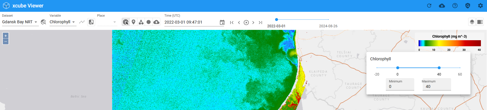
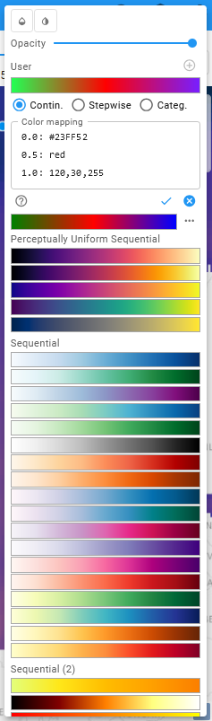

# Color Mapping

## Adjust the Value Range

To change the value ranges of the displayed variable click into the area of the legend where the value ticks are located or you can enter the desired values in the _Minimum_ and/or _Maximum_ text field.

## Change or create Color Maps

You can change the color mapping as well by clicking into the color range of the legend. There you can also decide to
hide lower values and it is possible to adjust the opacity.

