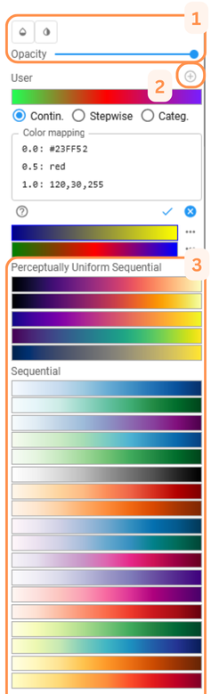

# Color Mapping

## Adjust the Value Range

To modify the value ranges of the displayed variable, click on the legend area where the value ticks are shown.

### Min/Max

Enter the desired values in the **Minimum** and/or **Maximum** text fields, or adjust the values directly on the **slider**.

{ align=right }

### Log-scaling

Enable **log-scaling** for the value range by toggling the switch in the top-right corner. [1]

### Color Map Value Range

If the color mapping has an assigned value range, apply it to the variable using the button at the top. [2]

---

## Change or create Color Maps

{ align=left }

Change the color mapping by clicking on the color range in the legend.

### Modify Map Presentation

Modify the presentation of the selected Color Map by [1]

- changing the opacity
- hiding small values
- reversing the color map

### Predefined Color Maps

Select a desired predefined color map from a wide range of maps (e.g. sequential, diverging, qualitative) [3].

### User-defined Color Maps

Add a user-defined color map with the `+`-button [2]. User-defined color mapping that associates data values or ranges of data values with color values. The lines in the text box have the general syntax
`<value>: <color>`, where `<color>` can be

- a list of RGB values, with values in the range 0 to 255, for example,
  `255,165,0` for the color Orange;
- a hexadecimal RGB value, e.g., `#FFA500`;
- or a valid [HTML color name](https://www.w3schools.com/colors/colors_names.asp)
  such as `Orange`, `BlanchedAlmond` or `MediumSeaGreen`.

The color value may be suffixed by a opaqueness (alpha) value in the range
0 to 1, for example `110,220,230,0.5` or `#FFA500,0.8` or `Blue,0`.
Hexadecimal values can also be written including an alpha value,
such as `#FFA500CD`.

The interpretation of the `<value>` depends on the selected color mapping
type:

- **Continuous:** Continuous color assignment, where each `<value>`
  represents a support point of a color gradient.
- **Stepwise:** Stepwise color mapping where values within the range of two
  subsequent `<value>`s are mapped to the same color. A `<color>` gets associated with the
  first `<value>` of each boundary range, while the last color gets ignored.
- **Categorical:** Values represent unique categories or indexes that are
  mapped to a color. The data and the `<value>` must be of type integer.
  If a category does not have a `<value>` in the color mapping, it will be
  displayed as transparent. Suitable for categorical datasets.
