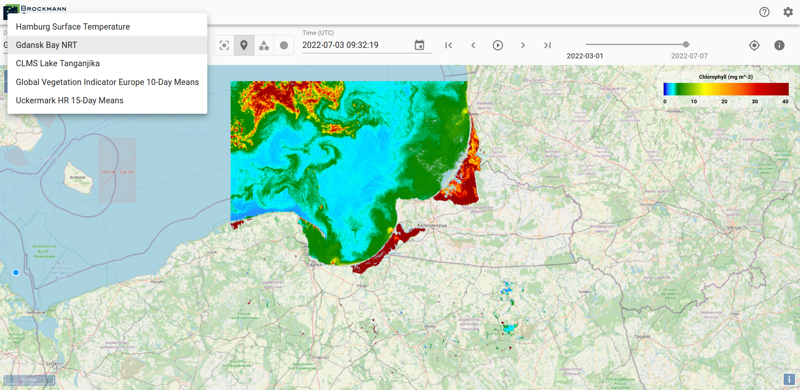
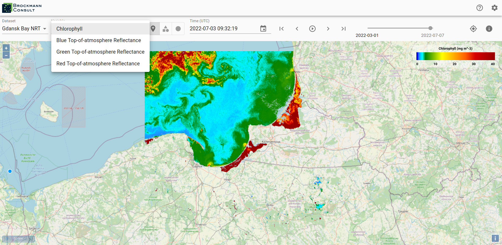
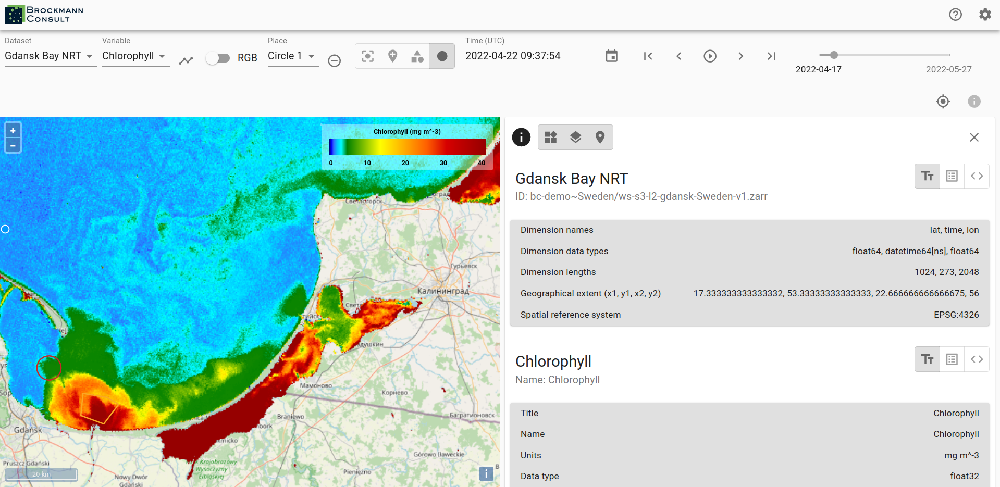

# Data Management

A xcube viewer may hold several xcube datasets which you can select via the drop-down menu _Dataset_.
The viewed area automatically adjusts to a selected xcube dataset, meaning that if a newly selected
dataset is located in a different region, the correct region is displayed on the map.

If more than one variable is available within a selected xcube dataset, you may change the variable by using the drop-down menu
_Variable_.

To see metadata for a dataset click on the _info_-icon on the right-hand side. Besides the dataset metadata you will
see the metadata for the selected variable.

