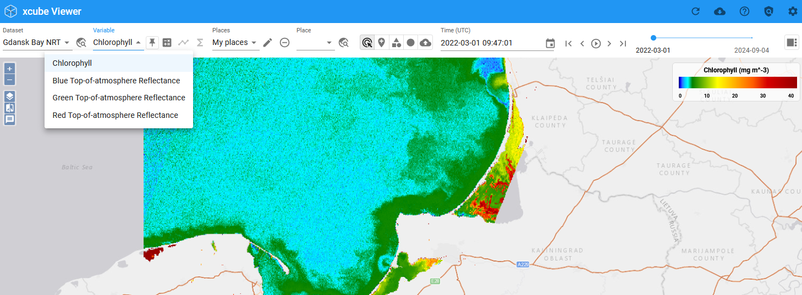

# Data Management

## Select Dataset and Variables

A xcube viewer may hold several xcube datasets which you can select via the drop-down menu **Dataset**.
The viewed area automatically adjusts to a selected xcube dataset, meaning that if a newly selected
dataset is located in a different region, the correct region is displayed on the map.

If more than one variable is available within a selected xcube dataset, you may change the variable by using the drop-down menu
**Variable**.

## Integrate (User) Base Maps and Overlays

The Viewer gives the option to display the datasets in front of a Base Map and to overlay datasets with additional information (regarding e.g. transportation or place names). A large number of Base Maps and Overlay layers are already integrated in the viewer and additional ones can be added as well. Further instructions can be found [here](../user_guide/settings.md/#base-maps-and-overlays).

## Adjust Layer Visibilities

    
    
The metadata of the datasets, individual variables and places can be accessed in the sidebar. The information is available in various formats. To access the metadata click on the **info**-tab..

{ align=right }

## Metadata

The metadata of the datasets, individual variables and places can be accessed in the sidebar. The information is available in various formats. To access the metadata click on the **info**-tab.

---
