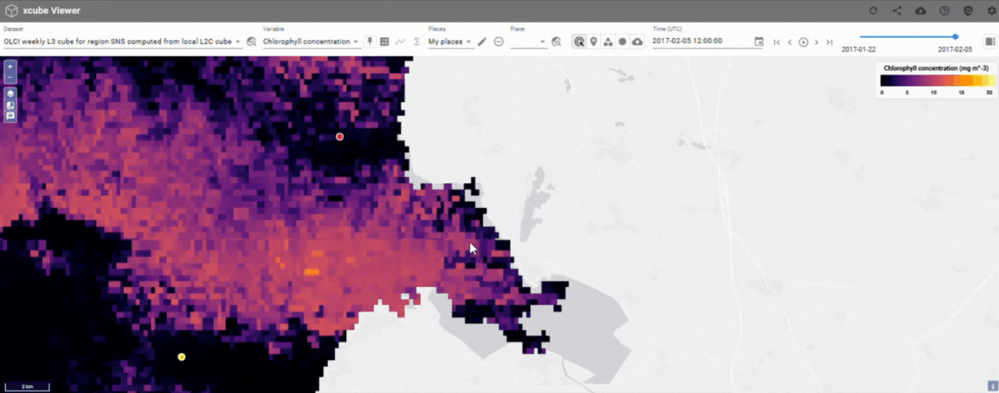
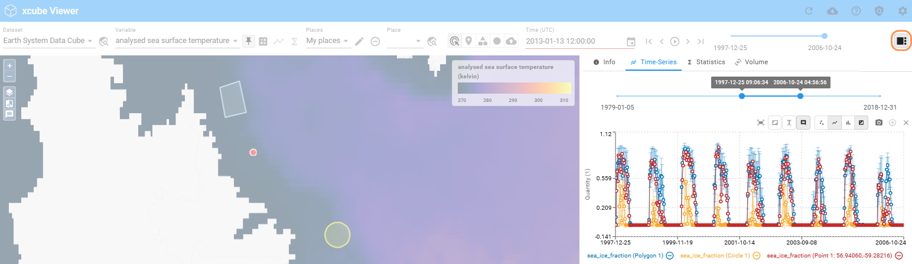

# Getting Started

## Select Dataset and Variables

A xcube viewer may hold several [datasets](../concepts.md/#dataset) which you can select via the drop-down menu **Dataset**. When a new dataset gets [selected](../concepts.md/#selected-dataset), the map extent changes, according to the option selected in the [settings](../user_guide/settings.md/#zoom-on-datasetplace-selection).

If more than one [variable](../concepts.md/#variable) is available within a [selected xcube dataset](../concepts.md/#selected-dataset), you may change the variable by using the drop-down menu
**Variable**.

---

## Integrate (User) Base Maps and Overlays

The Viewer gives the option to display the datasets in front of a [base map](../concepts.md/#basemaps-and-overlays) and to [overlay](../concepts.md/#basemaps-and-overlays) datasets with additional information, such as transportation routes or place names. A large number of base maps and overlay layers are already integrated in the Viewer, with the option to add more as needed. Further instructions can be found [here](../user_guide/settings.md/#base-maps-and-overlays).

---

## Adjust Layer Visibilities

{ align=right }

The draggable Layer Visibility Menu can be opened on the left-hand side of the viewer. The menu can be used to control the display and hiding of the following [layers](../concepts.md/#layers):

- [Selected Variable](../concepts.md/#variable-layer)
- [Pinned Variable](../concepts.md/#pinned-variable) (marked by icon)
- User and Dataset [Places](../concepts.md/#places-and-place-groups)
- [Base Map and Overlay](../concepts.md/#basemaps-and-overlays)
- boundary box of the selected Dataset
- [RGB of Dataset](../concepts.md/#dataset-rgb-layer) (selected and pinned)

User Base Maps and User Overlays can also be added here.

---

## Share State of Viewer

Create a permalink to share a state of the Viewer. If this link can be shared with others depends on the deployment.

A restored state holds:

- Selected map region, zoom level, and overlays.
- User places including the selected place.
- Opened panels, active tabs, and any selected options.
- Other UI-specific states such as selected items, filters, or toggle states.

---

## Sidebar

The sidebar provides access to various panels. The selection of available panels is configurable and may vary depending on the deployment. The feature can be shown or hidden using the button located in the top-right corner.

**Always Available Panels**

- **Info:** Displays [metadata](#metadata) and relevant information.
- **Time Series:** Provides [time series](analyse.md/#time-series) visualizations.
- **Statistics:** Offers [statistical](analyse.md/#statistics) insights.

**Optional Panels**

- **Volume:** Provides 3D visualization of cubes.
- **User-Defined Panels:** This feature will be introduced in future versions of xcube-viewer.

---

## Metadata

{ align=left }

The metadata information is accessible through a tab in the sidebar, which can be displayed using a button on the right side of the Viewer [1]. This section displays metadata for the [selected dataset](../concepts.md/#selected-dataset), [variable](../concepts.md/#selected-variable), or [location](../concepts.md/#selected-place). The visibility of this information can be enabled at the top left [2].

The metadata can be displayed in three different formats:

1. **Textual:** a property summary in human readable form
2. **Tabular:** the complete list of attributes in a table
3. **JSON:** all the attributes as machine-readable JSON

The format is selected to the right of the title [3].
