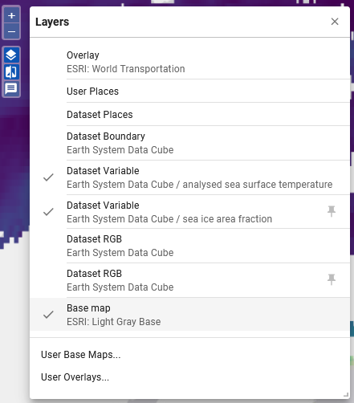

# Getting Started

## Select Dataset and Variables

A xcube viewer may hold several xcube datasets which you can select via the drop-down menu **Dataset**.
The viewed area automatically adjusts to a selected xcube dataset, meaning that if a newly selected
dataset is located in a different region, the correct region is displayed on the map.

If more than one variable is available within a selected xcube dataset, you may change the variable by using the drop-down menu
**Variable**.

---

## Integrate (User) Base Maps and Overlays

The Viewer gives the option to display the datasets in front of a Base Map and to overlay datasets with additional information (regarding e.g. transportation or place names). A large number of Base Maps and Overlay layers are already integrated in the viewer and additional ones can be added as well. Further instructions can be found [here](../user_guide/settings.md/#base-maps-and-overlays).

---

{ align=right }

## Adjust Layer Visibilities

The draggable Layer Visibility Menu can be opened on the left-hand side of the viewer. The menu can be used to control the display and hiding of the following objects:

- selected Variable
- pinned Variable (marked by icon)
- User and Dataset Places,
- Base Map and Overlay,
- Boundary Box of the selected Dataset
- RGB of Dataset (selected and pinned).

User Base Maps and User Overlays can also be added here.

---

{ align=left }

## Metadata

The metadata is placed in a tab in the sidebar, which can be enabled on the right side of the viewer [1]. Here, meta information of the selected dataset, the selected variable or a selected place can be displayed. The information is enabled at the top left [2].

The information can be displayed in three different formats:

- Format 1
- Format 2
- Python code that can be used to select a dataset or variable. This is useful for further analysing data, e.g., in Jupyter Notebooks.

The format is selected to the right of the title [3].
