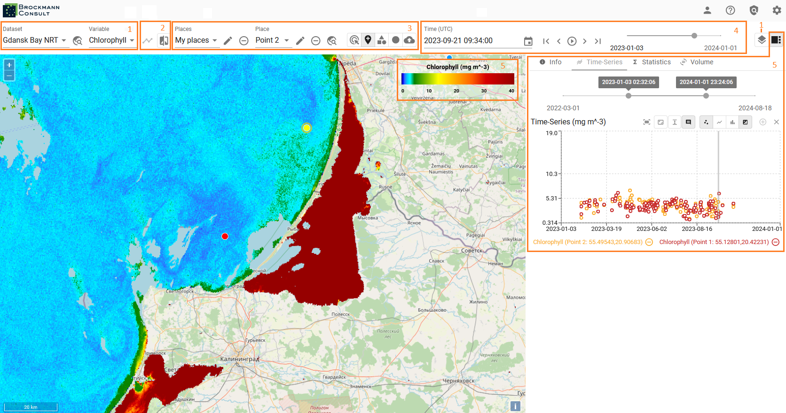

---
hide:
  - toc
---

# User Guide

The Viewer interface is divided into several functional groups. The contents of this User Guide are structured according to these groups.

??? info "The Basics"

    **Zoom:** buttons in the top left corner or zooming function of your computer mouse.

    **Scaling:** located in the lower left corner

    **Legend:** Color Mapping Box on the upper right corner

**These are the groups:**

- [Settings](settings.md)

      * General
      * Time-Series
      * Map

- [Datamanagement](datamanagement.md)

      * Select Dataset and Variables
      * Integrate Base Maps and Overlays
      * Adjust Layer Visibilities
      * Metadata

- Analyse (create Time Series and Compare Variables)
- Create and manage Places for Statistics and Time Series
- Select Dates from the Dataset or iterate through dataset with Player
- Sidebar (diplay Metadata, Statistics or Time Series)
- Color Mapping (change and create Color Mapping)

---

The xcube viewer app is constantly evolving and enhancements are added, therefore please be aware that the above
described features may not always be completely up-to-date.
