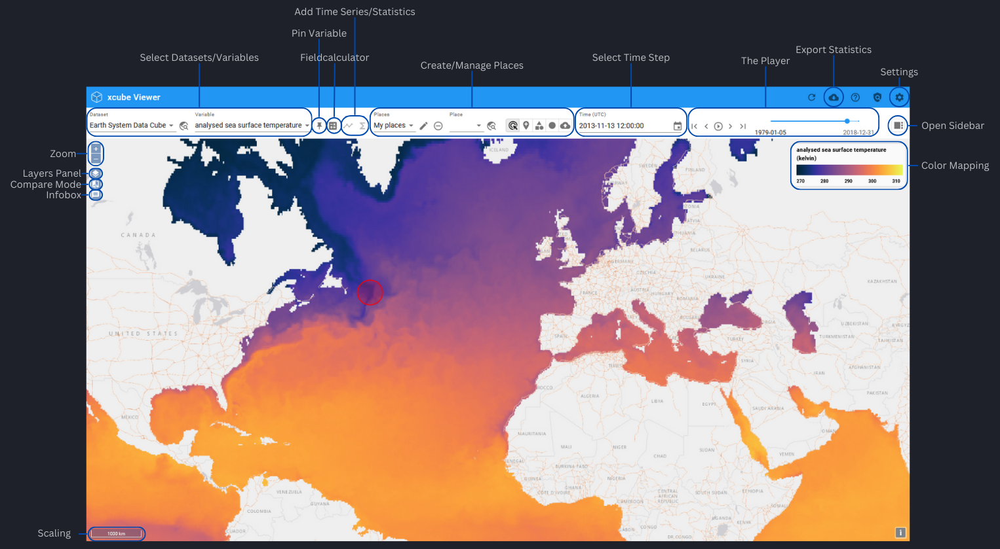

---
hide:
  - toc
---

# The Viewer Interface

{: class="light-image" }
{: class="dark-image" }

??? info "The Basics"

    **Zoom:** use buttons in the top left corner or zoom with your computer mouse.
