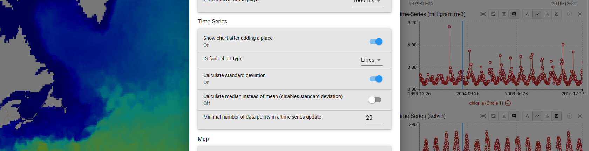

# Adjust Settings

In the settings, you have the option to adjust the default settings according to your needs. This can be the xcube Server, the language or adjustments to the Player, time series or the map. Detailed explanations of specific settings are provided below. Additionally, you can find information about legal agreements, as well as the Viewer and server version, within the settings.

---

## General

### Change the Server

Change the Server URL by selecting `Server` and clicking the `+`-button to add a new server.

### Player Interval

Adjust the Player's interval settings. Additional information on the Player can be found [here](../user_guide/analyse.md/#the-player).

---

## Time-Series

This is the place to set preferences of displaying data and graphs of the time series. Additional information on time series can be found [here](../user_guide/analyse.md/#time-series).

---

## Map

Adjust the **base map** and **overlays**, choose the **projection** (_Geographic_ or _Mercator_), enable **image smoothing** or decide on the **map extent and focus** when selecting datasets or places.

### Base maps and Overlays

The Viewer allows you to display datasets over a Base Map and overlay them with additional information, such as transportation routes or place names. A large number of base maps and overlay layers are already integrated in the Viewer. Others can be selected by clicking on `Base map` or `Overlay`.

### User Base maps and Overlays

Additional layers (WMS, XYZ) from external services can also be added by clicking on `User base map...` or `User overlays...`. These can also be added via the [Layers Panel](../user_guide/getting_started.md/#adjust-layer-visibilities).

### Zoom on Dataset/Place Selection

The map extent can be changed when selecting a new Dataset or Place. The following options are available:

- `pan` : map moves to the center of dataset bounding box
- `pan and zoom`: map moves to the center and zooms to the extent of the dataset
- `do nothing`
