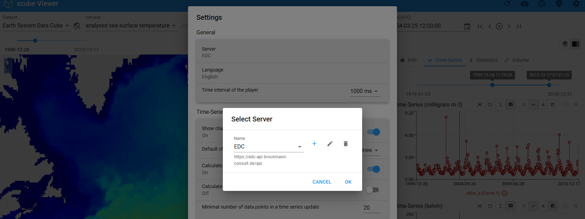

# Adjust Settings

In the settings, the user has the option of adjusting the default settings according to their needs. This can be the server, the language or adjustments to the player, time series or the map. A selection of settings are explained in more detail below. Information regarding the legal agreements and the viewer and server version is also given here.

---

## General

### Change the Server

Change the Server URL by selecting 'Server'. A 'Select Server' panel is opened and click the "+" button to add a new server.

### Player Interval

Adjust the interval of the Player. Additional information on the Player can be found [here](../user_guide/analyse.md/#the-player).

## Time-Series

This is the place to set preferences of displaying data and graphs of the time series. Additional information on the Player can be found [here](../user_guide/analyse.md).

---

## Map

Adjust the **Base Map** and **Overlays**, switch the displayed **projection** between _Geographic_ and _Mercator_. You can also choose to turn **image smoothing** on decide on the **zoom** of the Viewer when secting a dataset or place (e.g. zoom to place).

### Base maps and Overlays

The Viewer gives the option to display the datasets in front of a Base Map and to overlay datasets with additional information (regarding e.g. transportation or place names). A large number of Base Maps and Overlay layers are already integrated in the viewer. Other can be selected by clicking on 'Base map' or 'Overlay'.

Additional layers (WMS, XYZ) from external services can also be added by clicking on 'User base map...' or 'User overlays...'. Additionally, 'User base maps' and 'User overlays' can be added via the [Layers Panel](../user_guide/getting_started.md/#adjust-layer-visibilities).

### Zoom on Dataset/Variable selection

The map extent can be changes when selecting a new Dataset or Variable. The following options are available:

- `pan` : map moves to the center of dataset bounding box
- `pan and zoom`: map moves to the center and zooms to the extent of the dataset
- `do nothing`
