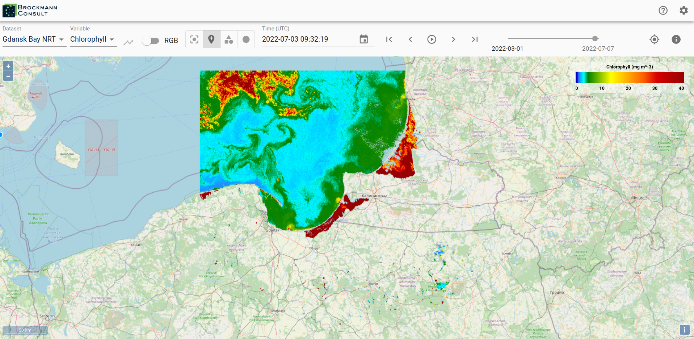
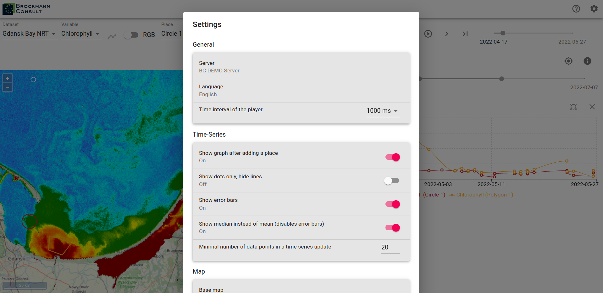
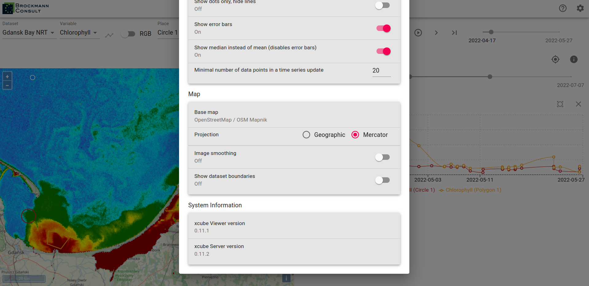
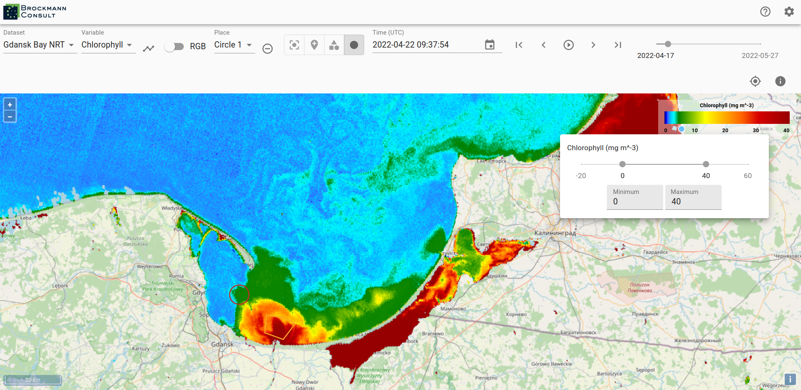
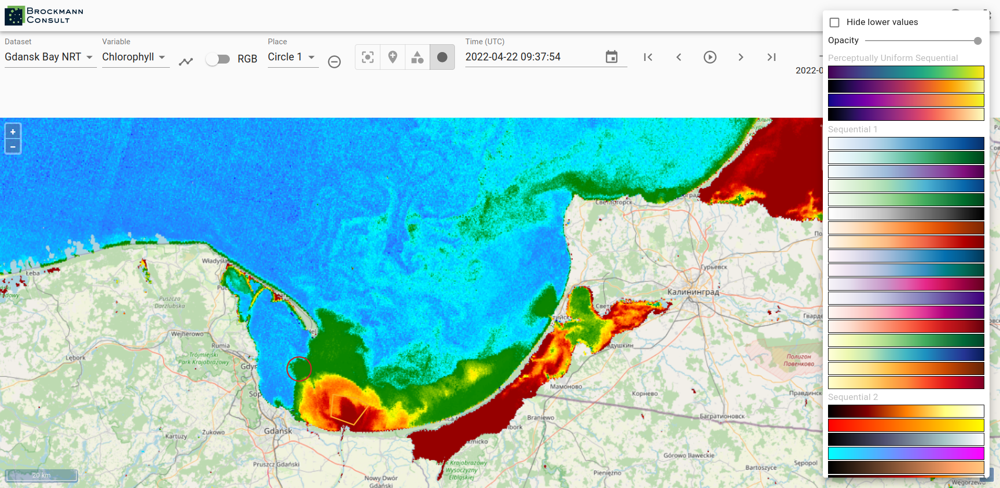

## Functionality

For zooming use the buttons in the top right corner of the map window or the zooming function of your
computer mouse. A scale for the map is located in the lower right corner and in the
upper left corner a corresponding legend to the mapped data of the data cube is available.

A xcube viewer may hold several xcube datasets which you can select via the drop-down menu _Dataset_.
The viewed area automatically adjusts to a selected xcube dataset, meaning that if a newly selected
dataset is located in a different region, the correct region is displayed on the map.

If more than one variable is available within a selected xcube dataset, you may change the variable by using the drop-down menu
_Variable_.

To see metadata for a dataset click on the _info_-icon on the right-hand side. Besides the dataset metadata you will
see the metadata for the selected variable.

To obtain a time series set a point marker on the map and then select the _graph_-icon next to the _Variables_ drop-down
menu. You can select a different date by clicking into the time series graph on a value of interest. The data displayed
in the viewer changes accordingly to the newly selected date.

The current date is preserved when you select a different variable and the data of the variable is mapped for the date.

To generate a time series for the newly selected variable press the _time series_-icon again.

You may place multiple points on the map and you can generate time series for them. This allows a comparison between
two locations. The color of the points corresponds to the color of the graph in the time series. You can find the
coordinates of the point markers visualized in the time series beneath the graphs.

To delete a created location use the _remove_-icon next to the _Place_ drop-down menu.
Not only point location may be selected via the viewer, you can draw polygons and circular areas by using the icons on
the right-hand side of the _Place_ drop-down menu as well. You can visualize time series for areas, too.

In order to change the date for the data display use the calendar or step through the time line with the
arrows on the right-hand side of the calendar.

When a time series is displayed two time-line tools are visible, the upper one for selecting the date displayed
on the map of the viewer and the lower one may be used to narrow the time frame displayed in the time series graph.
Just above the graph of the time series on the right-hand side is an _x_-icon for removing the time series from the
view and to left of it is an icon which sets the time series back to the whole time extent.

To adjust the default settings select the _Settings_-icon on the very top right corner.
There you have the possibility to change the server url, in order to view data which is available via a different server.
You can choose a different language - if available - as well as set your preferences of displaying data and graph of
the time series.

To see the map settings please scroll down in the settings window. There you can adjust the base map, switch the
displayed projection between _Geographic_ and _Mercator_. You can also choose to turn image smoothing on and to
view the dataset boundaries.

On the very bottom of the _Settings_ pop-up window you can see information about the viewer and server version.

Back to the general view, if you would like to change the value ranges of the displayed variable you can do it by
clicking into the area of the legend where the value ticks are located or you can enter the desired values in the
_Minimum_ and/or _Maximum_ text field.

You can change the color mapping as well by clicking into the color range of the legend. There you can also decide to
hide lower values and it is possible to adjust the opacity.

The xcube viewer app is constantly evolving and enhancements are added, therefore please be aware that the above
described features may not always be completely up-to-date.
