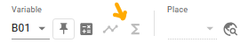
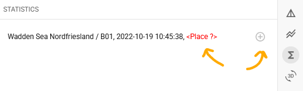
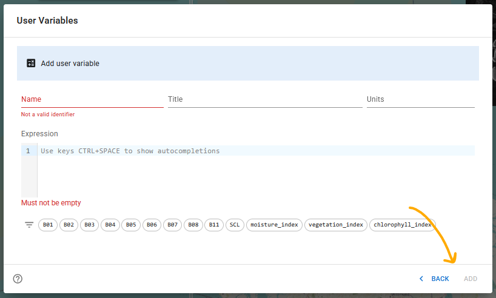
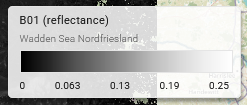
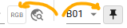

# Style Guide 

**Note: This is a living document and in an early stage of development.**

## Introduction

xcube Viewer is developed using the React component library [Material UI](https://mui.com/material-ui/getting-started/)
that implements [Google's Material Design System](https://m3.material.io/).
This guideline outlines how the xcube Viewer development builds upon the Material 
Design System. It defines how components should be structured to ensure consistent 
usability and describes the styling principles that maintain a unified UI 
across all features.

## Usability

### General
- Each tool or feature should have a corresponding shortcut button in the toolbar 
  (Example: Statistics or Time Series creation).

- If a tool cannot be used, for instance due to a missing geometry selection or
  incomplete term in the User Variable Dialog the feature should: 

  1. Disable its interactive elements and
  2. Display an informational text explaining why the feature is unavailable.

### Dialogs
Each dialog (e.g. User Variables) should offer three ways to close it:
- **Accept** changes made in the dialog using an `OK` button. 
- **Discard** changes made in the dialog using a `CANCEL` button. 
- **Discard** changes by clicking outside the dialog.

### Dialogs with nested Dialogs
Dialogs that contain internal (nested) dialogs (e.g. Add/Edit User Variables) 
should also offer three ways to close:
- **Accept** changes made in the nested dialog using a button labeled `Edit`, `Apply`, or `OK`. 
- **Discard** changes using a `Back` button with a `return` icon. 
- **Discard** changes by clicking outside the nested dialog.

### Sidebar Panels
Some general points are listed in this [issue](https://github.com/xcube-dev/xcube-viewer/issues/483).
As they are relevant for most features in the Viewer, they are repeated
[here](#general).

## Styling

### Map Elements
- Opacity: `0.8`
- Shadow: use as shown in the color bar (not applied to buttons or the scale bar)

### Toggle Buttons
- Solid border 
- Background color changes to indicate the toggle state 
- Examples: the `RGB layer` button or the `pin variable` button

