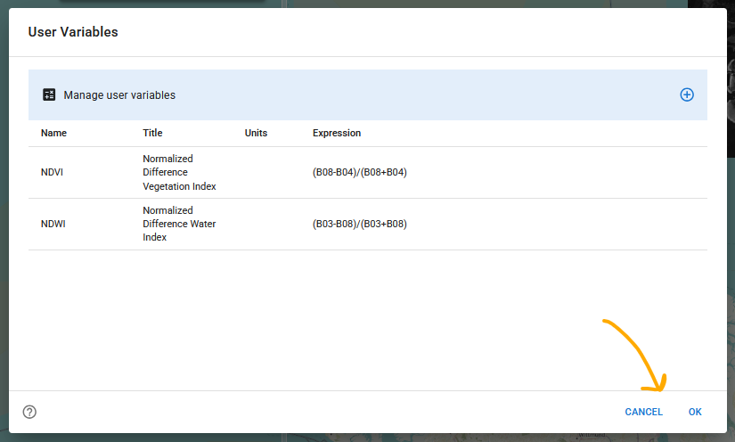

# Style Guide 

**Note: This is a living document and in the early stages of development.**

## Introduction

xcube Viewer is developed with the React component [Material UI](https://mui.com/material-ui/getting-started/)
that implements [Google's Material](https://m3.material.io/) Design System.
This guideline outlines how the xcube Viewer development builds upon the used 
design system. It defines how components should be structured to ensure consistent 
usability and describes the styling principles that maintain a unified UI 
across all features.

## Usability

### General
- Every tool or feature should have a shortcut (button) in the toolbar 
  (Example: Statistics or Time Series creation).
- If a tool is not able to be used, due to e.g. a missing geometry selection or
  incomplete term in the User Variable Dialog the feature should (a) disable 
  its interactional features and (b) show an info text, why the feature is disabled.

### Dialogs
Three options, should be available, to close a dialog (Example: User Variables):
- Accepting changes, that were made in the dialog, by using a `OK`-button.
- **Not** accepting changes, that were made in the dialog, by using a
  `CANCEL`-button.
- **Not** accepting changes, that were made in the dialog, by clicking somewhere 
  outside the dialog.

### Dialogs with internal Dialogs
Three options, should be available, to close a dialog within a dialog
(Example: Add/Edit User Variables ):
- Accepting changes, that were made in the dialog by using a button with a text 
  like `Edit`, `Apply`, or `OK`.
- **Not** accepting changes, that were made in the dialog, by using a
  `Back`-button with a return icon.
- **Not** accepting changes, that were made in the dialog, by clicking
  somewhere outside the dialog.

### Sidebar Panels
- A selection of points are mentioned in this [issue](https://github.com/xcube-dev/xcube-viewer/issues/483).
  But they are important for most features in the Viewer, therefore the points 
  are listed [here](#general).

## Styling

### Map Elements
- Opacity: 0.8
- Shadow (see color bar, not used for buttons and scale bar)

### Toggle Buttons
- Solid border
- Change of background color that visualizes the toggle mode
- Examples: button to enable RGB layer or button to pin a variable

